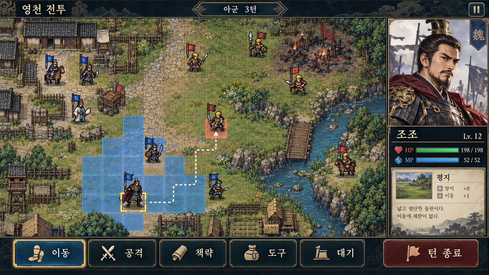
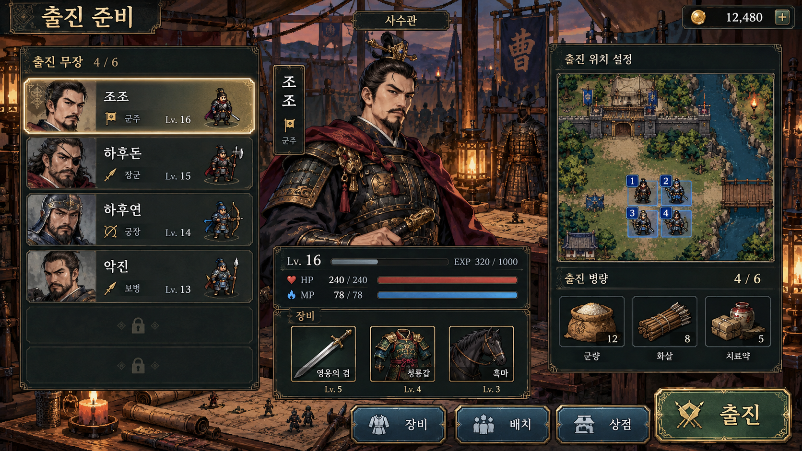
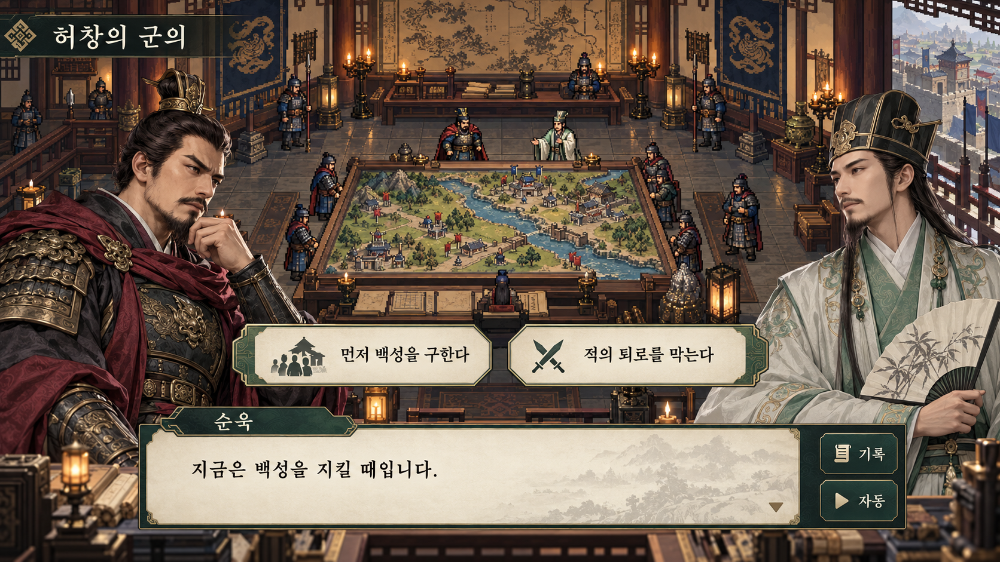
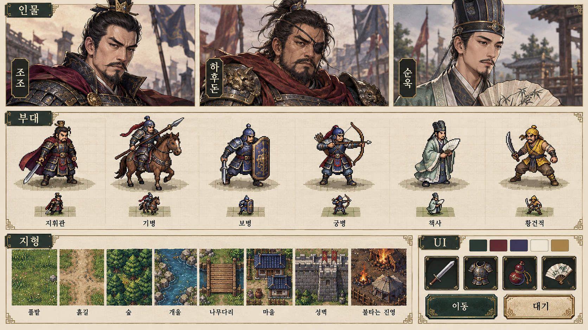
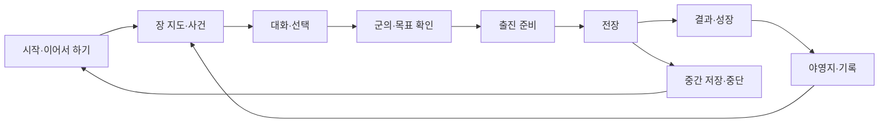

# 화면·UI/UX·리마스터 그래픽 명세 v0.1

## 1. 아트 방향

사용자의 선택: **원작 도트 전장을 살린 리마스터 + 정교한 인물 일러스트**.

전장을 현대적인 3D나 등각 시점으로 바꾸지 않고 원작의 평면 격자, 작은 부대, 역사적 건축물, 차분한 색을 유지한다. 늘어나는 디테일은 갑옷의 판금·천·가죽 구분, 말의 실루엣, 기와·돌·수목의 형태, 물·깃발·불의 움직임에 사용한다. 장식보다 부대와 지형의 구분을 우선한다.

| 대상 | 유지할 감각 | 리마스터 방식 |
|---|---|---|
| 전장 | 평면 사각 격자·넓은 길·마을·숲 | 촘촘한 타일 묘사, 경계 타일, 부드러운 환경 애니메이션 |
| 부대 | 작은 3/4 시점 인물·병과 실루엣 | 세부 갑옷·무기·말·망토, 더 풍부한 동작 |
| 인물 | 인물마다 다른 얼굴과 표정 | 고해상도 역사극 일러스트, 시대·감정 변형 |
| 이야기 | 도트 세계 안에서 인물들이 등장 | 도트 실내·지도 디오라마 위에 초상과 대화 배치 |
| UI | 고전 전략 게임의 절제된 틀 | 옥색·남색·종이색 패널, 큰 터치 영역과 읽기 쉬운 서체 |
| 책략 | 짧고 명확한 큰 효과 | 세부 불·연기·물 효과, 피격칸을 가리지 않는 투명도 |

새 아트를 만드는 기준이며 원작 스프라이트의 복사·추출을 전제로 하지 않는다.

## 2. 검토용 이미지

### 전투 화면

평면 도트 지도, 작은 부대의 역할 구분, 오른쪽 조조 정보, 하단 명령이라는 방향을 보여준다. 이미지의 Lv.12·HP·MP는 정보 배치 예시다. 실제 영천은 Lv.3으로 시작한다. 점선 경로·이동칸은 콘셉트 표현이며 실제 도달 가능 판정은 전술 코어에서 만든다.

### 출진 준비

목록·선택 장수·장비·배치를 한 화면에서 비교하는 방향이다. 장수 Lv.16과 장비 이름·화살 보급 아이콘은 샘플이다. 최초 구현에는 장수 모집 잠금 슬롯·화살 수량 관리·추가 재화 기능을 넣지 않는다. 하후돈의 병과는 기병으로 표기하고, 사수관 시점의 초상은 안대가 없는 초기 모습으로 제작한다.

### 대화와 선택

도트 군의 공간과 정교한 인물 초상의 조합이다. 대사와 선택지는 새로 쓴 예시다. 작은 기기에서는 인물·대화창과 선택지가 겹치지 않도록 선택지를 별도 중심 패널로 올린다. 허창 장면은 후속 이야기 예시이며 첫 전투의 군의 장소가 아니다.

### 캐릭터·타일·UI 방향

그림의 부대 6종은 방향 예시다. 첫 5전투의 실제 병과는 8종이다. 이 이미지에서 애니메이션 프레임을 잘라 최종 리소스로 사용하지 않는다. 초상·스프라이트는 개별 원본과 공통 규격으로 다시 제작한다.

## 3. 화면 흐름

## 4. 12개 화면·상태의 상세 구성

| ID | 화면·상태 | 주요 정보 | 주요 행동 | 설계 핵심 |
|---|---|---|---|---|
| U01 | 시작·이어서 하기 | 현재 장·전투·마지막 저장 | 계속, 새 게임, 저장 선택, 설정 | 마지막 전투까지 한 번에 복귀 |
| U02 | 장 지도 | 전투 노드, 진행 경로, 사건 기록 | 다음 사건, 완료 전투 기록 | 전투별 요약과 연결이 명확해야 함 |
| U03 | 이야기·선택 | 배경, 인물, 대사, 선택지 | 다음, 기록, 자동, 건너뛰기 | 선택지에서 자동 진행 중지 |
| U04 | 군의 | 목표·패배·지형·적·필수 장수 | 계획 확인, 출진 준비 | 중요한 위험과 호위 조건 예고 |
| U05 | 출진 준비·야영지 | 장수 목록, 출진 인원, 회복품 | 선택, 장비, 배치, 상점, 출진 | 세부 메뉴를 오가도 선택 유지 |
| U06 | 장수·장비 상세 | 능력·병과·장비·숙련·상태 | 비교, 장착, 해제 | 장착 전후 차이를 수치와 말로 표시 |
| U07 | 배치 | 아군 시작 칸, 전선, 목표 | 자리 교환, 자동 배치, 확정 | 출진 순서가 위치를 몰래 바꾸지 않음 |
| U08 | 전투 기본 | 전장, 진영·라운드, 목표, 부대 | 선택, 이동, 지도 이동, 턴 종료 | 전장 면적과 정보 패널의 균형 |
| U09 | 행동 미리보기 | 대상·범위·피해·명중·반격·MP | 대상 변경, 확정, 취소 | 확정 전 결과와 비용이 보임 |
| U10 | 전투 이벤트·일기토 | 관련 장수·현재 효과·목표 변화 | 확인, 연출 건너뛰기 | 연출 생략과 판정 생략을 구분 |
| U11 | 결과·성장 | 승패·보조 목표·보상·레벨 변화 | 자세히, 계속, 재도전 | 무엇을 얻고 놓쳤는지 설명 |
| U12 | 저장·설정·기록 | 슬롯·음향·속도·글자·조작 안내 | 저장/불러오기, 내보내기, 변경 | 진행 상황과 설정을 확실히 복구 |

U09·U10은 별도 장면으로 이동하는 화면이 아니라 전투 위에 표시하는 상태다. U12는 탭으로 나눠 한 번에 작은 항목만 보여준다.

### U01 시작·복귀

배경은 새 게임의 도트 야영지 또는 원경이다. 가장 큰 버튼은 “이어서 하기”이고 아래에 “새 게임 / 저장 기록 / 설정”을 둔다. 이어서 하기 아래에 `영천 · 아군 3라운드 · 조조 Lv.3` 같은 저장 요약을 표시한다. 장기 다운로드가 필요하면 용량과 진행 상황을 보여준다. 앱을 다시 켤 때 로그인이나 전체 캠페인 다운로드를 요구하지 않는다.

### U02 장 지도

회화 지형 위에 전투 노드를 얹되 도시 크기로 실제 이동 거리를 의미하지 않게 한다. 완료·현재·미진행 노드의 모양을 구분한다. 오른쪽/하단 패널에는 전투 이름, 등장 장수, 완료 목표, 이야기 선택의 기록을 표시한다. 한 번에 10개 전투 정도의 장별 지도를 사용한다. 지나치게 많은 아이콘을 지도에 동시에 보여주지 않는다.

### U03 이야기·선택

한 화면에 대사 2~3줄, 화자명, 인물 최대 2명. 전체 대사창 탭으로 다음으로 진행한다. “기록”은 현재 장면의 이전 대사 목록을 열고, “자동”은 대사 읽기 간격에 맞춘다. 선택이 나오면 자동을 멈추고 선택지에 손을 대도 먼저 강조만 한다. 두 번째 탭 또는 명시적인 선택 확인으로 확정한다. 이미 읽은 대화는 빠르게 넘길 수 있다. 중요한 선택은 현재 목표에 미칠 영향을 짧게 설명한다.

### U04 군의

상단에 전투 이름, 가운데 작은 지도, 하단에 `승리 / 패배 / 보조 목표` 3항목. 새로운 규칙은 한 문장과 그림 한 개로 설명한다. “전위 구출은 선택 목표입니다”처럼 기본 진행과 어려운 도전을 구분한다. 미확인 복병의 위치는 숨길 수 있지만 매복 가능성은 미리 예고한다.

### U05 출진 준비

큰 기기: 왼쪽 목록 30%, 중앙 장수 35%, 오른쪽 배치·회복품 35%. 작은 기기: 목록과 상세 2열, 배치는 별도 탭. 출진 슬롯은 체크와 숫자로 표시하며 기본 정렬은 합류 순서다. 역할 필터·레벨 정렬을 추가할 수 있다. “출진” 전 필수 장수·정원·장비 없음만 요약하고 불필요한 경고를 반복하지 않는다. 상점에서 산 품목은 장수별로 반복 배분하지 않고 공용 회복품 목록에 넣는다.

### U06 장수·장비

초상, 병과와 진급 단계, 핵심 능력치, 장비 3개, 책략 목록. 장비 선택 시 현재·후보를 나란히 비교하고 `방어 +4 / 이동 변화 없음 / 궁병 피해 감소`처럼 효과를 말로 보여준다. 아직 배울 수 없는 책략은 배울 시점을 표시한다. 다섯 기반 능력치와 전투 능력치는 탭으로 나눠 작은 화면에 숫자가 쌓이지 않게 한다.

### U07 배치

시작 지역에만 배치한다. 장수를 탭하고 빈 시작 칸을 탭하면 이동, 장수 칸을 탭하면 교환 미리보기를 표시한다. 드래그 교환은 선택적 보조 기능이다. 확정 전 언제든 취소할 수 있다. 자동 배치는 전열에 보병·기병, 후열에 원거리·책사를 넣는다. 자동 배치가 유일한 정답이라고 표시하지 않는다.

### U08 전투 기본

기본 가로 레이아웃: 상단 상태 7~10%, 하단 명령 12~16%, 나머지는 지도와 선택 부대 정보. 지도는 중앙·왼쪽 75~80%, 우측 패널은 약 20~25%. 작은 높이에서는 우측 큰 초상을 접고 정보 카드 한 줄로 바꾼다.

- 상단: 전투명, 현재 진영·라운드, 목표 버튼, 일시 정지.
- 지도: 아군 파란 깃발·원형, 적군 붉은 깃발·마름모, 우군 청록·이중 원형.
- 선택 정보: 초상, 이름·병과, HP·MP, 상태, 현재 지형.
- 하단: 이동 / 공격 / 책략 / 도구 / 대기. 턴 종료는 별도 구역.
- 미행동 장수로 이동하는 다음 부대 버튼. 목록을 열면 행동 여부를 아이콘으로 표시한다.

전체 지도를 축소하면 전술 개요 모드가 된다. 전술 개요에서 즉시 공격을 확정하지 않고 해당 위치 확대·부대 선택으로 연결한다.

### U09 미리보기

타일: 이동은 파랑+사각 테두리, 공격은 주홍+모서리 표시, 아군 책략은 청록+십자, 적 위협은 빗금. 오버레이는 지형이 보이도록 낮은 불투명도를 사용한다.

피해 패널 예: `적 HP 54 → 18 / 피해 36 / 명중 95% / 반격 12 / MP 0`. 회복은 `아군 HP 28 → 63 / 회복 35 / MP 6`. 불가능한 대상은 이유를 표시한다. 버튼은 “확정 / 취소”를 떨어뜨려 놓는다. 화면 가장자리의 대상 때문에 버튼이 손가락 아래에서 바뀌지 않게 한다.

### U10 이벤트·일기토

일기토는 2~4초의 짧은 확대 연출로 시작한다. 판정은 이벤트 데이터가 결정한다. 원작 같은 이름 있는 장수의 대결을 보여주되 연출을 생략해도 동일한 HP·퇴각·보상을 적용한다. 목표가 바뀌면 중앙 알림을 짧게 띄우고 목표 버튼에도 갱신 표시를 남긴다.

### U11 결과

승리 제목, 기본 목표, 보조 목표, 획득품, 장수별 성장의 순서로 보여준다. 성장 애니메이션은 한 번에 건너뛸 수 있다. “손견 생존: 완료 → 추가 장비”처럼 조건과 보상을 연결한다. 기본 보상과 선택 보상을 섞어 “완벽한 승리”만을 강요하지 않는다.

### U12 저장·설정

전투에서 일시 정지 시 가장 위에 현재 자동 저장 상태를 표시한다. 저장 완료 전에 종료 요청이 오면 짧게 기다린다. 소리·전투 속도·이벤트 속도·글자 크기·색 구분·흔들림·깜빡임을 조정한다. Android 뒤로는 상세창→명령 취소→일시 정지 순서로 닫는다. 앱 종료는 저장 결과를 확인한 뒤 처리한다.

## 5. 모바일 조작 규칙

| 입력 | 동작 | 오입력 방지 |
|---|---|---|
| 장수 탭 | 선택과 정보 확인 | 선택만으로 턴 소모 없음 |
| 이동칸 탭 | 경로·이동 미리보기 | 확정 단계 제공 |
| 적 탭 | 공격 대상·예측 | 먼저 정보를 보고 확정 |
| 지도 드래그 | 카메라 이동 | 드래그 뒤 탭으로 처리하지 않음 |
| 두 손가락 확대/축소 | 전술 배율 변경 | 지도 입력만 적용 |
| 오래 누르기 | 상세 정보 보조 기능 | 같은 정보는 일반 탭으로도 접근 가능 |
| 취소·뒤로 | 현재 미확정 단계 취소 | 이미 확정한 공격은 되돌리지 않음 |
| 턴 종료 | 남은 미행동 부대 표시 후 종료 | 별도 버튼; 미행동 부대가 없으면 추가 확인 생략 |

- 주요 터치 영역은 48 CSS px 이상, 최소 44 CSS px를 목표로 한다.
- 본문 16~18 CSS px, 보조 정보 최소 14 CSS px. 실제 기기에서 확인한다.
- 작은 칸의 부대 선택은 인접 후보를 확대해서 선택할 수 있게 한다.
- 상단 카메라 홀·노치, 하단 홈 인디케이터의 안전 영역을 반영한다.
- 게임은 가로 기준이다. 웹의 세로 상태에서는 회전 안내와 기록·설정만 편하게 보여준다. 웹 브라우저에서 화면 회전 강제 성공을 가정하지 않는다.
- 첫 터치 후 음향을 시작한다. 모바일 브라우저의 자동 재생 차단을 정상 동작으로 처리한다.
- 아군/적군을 색만으로 구별하지 않는다. 깃발·바닥 표식·선택 윤곽을 함께 사용한다.
- 중요한 도움말이 hover에만 있지 않도록 한다. 마우스·키보드도 같은 명령을 사용할 수 있다.

## 6. 그래픽 제작 규격

아래 크기는 새 게임의 소스 제작 규격이다. 원작의 실제 리소스 크기를 측정했다고 주장하지 않는다.

| 리소스 | 소스 규격 제안 | 게임 사용 |
|---|---|---|
| 바닥 타일 | 64×64 px | 평면 사각 격자, 경계·변형 타일 |
| 보행 장수 | 기본 64×80 px 캔버스 | 몸체 약 40~48×56~64 px, 바닥 기준점 통일 |
| 기마 장수 | 96×96 px 캔버스 | 말·창이 겹쳐도 발밑 점유칸은 1개 |
| 큰 건물 | 2~4칸 모듈 | 지붕 그림과 통행 판정 레이어 분리 |
| 장수 얼굴 | 512×640 px | 목록·전투 정보의 초상 |
| 장수 반신 | 1024×1280 px | 대화·장수 상세; 화면용 축소본 별도 생성 |
| 아이템 아이콘 | 64×64 px | 무기·방어구·회복품 |
| 상태 아이콘 | 32×32 px + 선택적 벡터 | 독·혼란·행동 완료 등 |
| 효과 프레임 | 128~256 px 범위 | 짧은 공격·회복·책략 |
| UI 패널 | 9-slice PNG 또는 벡터 | 화면 크기에 맞춰 늘림 |

전장 텍스처는 nearest 필터와 가능한 정수 배율을 사용하고 카메라를 픽셀에 맞춘다. 초상은 부드러운 축소 필터를 사용한다. HUD 글자는 도트 이미지에 굽지 않고 실제 글꼴로 그린다. 화면 전체를 한 장의 저해상도 그림처럼 확대하지 않는다.

## 7. 인물·부대의 일관성

| 인물 | 얼굴·기질 | 복식·색 | 전장 식별 |
|---|---|---|---|
| 조조 | 날카로운 눈, 짧은 수염, 절제된 자신감 | 짙은 옥색·검은 갑옷, 자주 망토 | 작은 지휘관 장식·망토 |
| 하후돈 | 강한 골격·결단력 | 철색 갑옷·붉은 천 | 창·무거운 기마 실루엣 |
| 하후연 | 민첩하고 냉정한 인상 | 남색·갈색 | 말 위의 활·화살통 |
| 악진 | 단단한 체격·집중 | 푸른 군복·방패 | 큰 방패와 낮은 중심 |
| 순욱 | 침착·지적인 눈 | 밝은 옥색 문관복 | 부채·긴 소매 |
| 순유 | 부드럽고 신중 | 옅은 청색 문관복 | 보검·회복 표식 |
| 전위 | 거대한 체격·곧은 성정 | 거친 가죽·철 장식 | 쌍무기·넓은 어깨 |
| 황건 부대 | 다양하되 한 진영으로 읽힘 | 황색 두건·낡은 흙색 옷 | 두건·짧은 도검 |

하후돈의 안대는 해당 사건 이후 적용한다. 초반과 후반 조조의 연령·수염 변화도 데이터로 구분한다. 콘셉트 아트 보드는 후반 하후돈 모습을 보여주며 초반 제작본의 기준은 사건 시점이다.

표정 목록: 기본 / 미소 / 결의 / 분노 / 놀람 / 슬픔. 중요한 장수는 4~6표정, 단역은 기본 1표정부터 만든다. 의상 변형은 동일한 얼굴 설계를 유지한다. 초상과 전장 스프라이트의 색·무기가 서로 맞아야 한다.

## 8. 애니메이션 제작 목록

방향은 상·하·좌·우 4개다. 몸·그림자·무기의 기준점을 동일하게 유지한다. 좌우 반전은 방패·안대·무기 손이 바뀌지 않는 경우만 허용한다.

| 동작 | 방향당 프레임 초안 | 용도 |
|---|---:|---|
| 대기 | 4 | 호흡·망토·말의 작은 움직임 |
| 이동 | 6 | 발·말 보행, 일정한 속도 |
| 공격 | 6 | 준비→충격→복귀 |
| 피격 | 2 | 짧은 반동·피해 표기 |
| 퇴각 | 4 | 쓰러짐·후퇴의 짧은 표현 |
| 책략 | 6 | 군주·책사·지원 등 필요한 병과만 |

기본 5동작은 1병과당 `22×4=88`프레임이다. 8병과 공통 원형은 704프레임, 군주·책사·지원의 책략 동작은 72프레임, 총 776프레임이 초기 제작 견적의 기준이다. 이름 있는 장수의 차이는 공통 동작을 공유하는 색·머리·망토·무기 레이어로 만든다. 모든 장수의 776프레임을 각각 새로 그리는 견적이 아니다.

애니메이션 수는 실제 움직임의 품질과 제작 인력에 따라 조정한다. 생성 이미지는 규격·방향·동작의 일관성을 보장하지 않으므로 프레임을 검수·정리하는 제작 단계가 필요하다.

## 9. 지형·지도 제작

타일은 바닥 / 이동 판정 / 장식 / 지붕·전면 / 그림자 / 효과 레이어로 나눈다. 건물의 불투명한 지붕이 부대를 가리면 자동으로 옅어지거나 선택 윤곽을 표시한다. 시각적으로 길처럼 보이는 곳과 실제 통행 판정을 맞춘다.

| 묶음 | 첫 제작 내용 | 확장 |
|---|---|---|
| 들판 | 풀·흙길·숲·얕은 물·다리·마을·진영 | 작물·황무지·넓은 수로 |
| 관문 | 돌벽·문·계단·깃발·성 안 바닥 | 포차·파괴 가능한 문 |
| 도시 | 골목·기와집·시장·가구 | 화재 단계·군중 |
| 산지 | 언덕·절벽·좁은 길 | 눈·험로·방어 진영 |
| 수상 | 강·선박·연결 다리 | 날씨·선박 화재 |

첫 5전투의 바닥·경계·변형 타일은 약 120개, 건물·수목·진영·장식 모듈은 약 45개를 제작 견적의 초안으로 둔다. 타일 수는 지형 종류 수와 같지 않다. 각 지형의 경계·접합·변형을 포함한다. 전체 캠페인에서는 눈·성채·선박 세트를 순차적으로 추가한다.

물·불·깃발의 환경 애니메이션은 4~6프레임부터 시작하고, 전술 오버레이는 환경 효과보다 위에 그린다. 화재가 지나치게 반짝여 선택 부대를 가리지 않도록 한다.

## 10. 최초 1전투와 5전투의 제작 수량

| 항목 | 영천 1개 검증 | 초반 5전투 목표 |
|---|---|---|
| 전투 지도 | 18×12 맵 1개 | 맵 5개, 들판·관문·퇴각로 |
| 보유 장수 | 조조 직접 조작, 우군 3명 | 9명 보유·출진 상한 8 |
| 병과 | 군주·우군 전투 원형·황건 부대 | 공통 원형 8종 |
| 이름 있는 초상 | 조조·유비·관우·장비·장보·장량 6명 | 아군 9 + 우군 4 + 적장 5 = 18명 |
| 초상 표정 | 조조 4표정 + 나머지 기본 = 9개 | 기본 18 + 조조 추가 5 + 하후돈 추가 3 + 순욱 추가 3 = 29개 |
| 이야기 배경 | 들판·지도 군의 2개 | 야영지·관문·낙양·마을 등 합계 6개 |
| 아이템 아이콘 | 초기 장비·회복품 8개 | 무기·방어구·보조·회복품 약 24개 |
| 공격·책략 효과 | 근접·피격·회복·화재·퇴각 | 궁시·격려·화계·낙석·수계·해독 등 약 12종 |
| UI 아이콘 | 기본 명령·목표·저장 약 16개 | 병과·상태·장비·설정 포함 약 40개 |
| 음향 | 결정·취소·이동·근접·피격·승리 | 궁시·책략·회복·패배 포함 약 18종 |
| 음악 | 전투·군의·결과 3곡 | 야영·대화·강적 포함 5~6곡 |

5전투의 우군 4명은 유비·관우·장비·손견, 적장 5명은 장보·장량·화웅·여포·청주 우두머리다. 시나리오에 등장만 하는 문관은 이 범위에서 대사나 실루엣으로 처리하고 필수 반신 초상을 늘리지 않는다.

음향·음악은 이번 결과물에 포함되지 않는다. 수량은 개발·제작 계획을 위한 범위다. 최종 그래픽 파일·게임용 타일셋·프레임 시트 역시 아직 완성되지 않았다.

## 11. 색·서체·컴포넌트

| 용도 | 색 후보 |
|---|---|
| 패널 바탕 | 옥흑 `#172D2A` |
| 서브 패널 | 남색 `#25354A` |
| 종이·밝은 본문 | `#F1E5C9` |
| 테두리·강조 | 낡은 금색 `#B89658` |
| 아군 이동 | 청색 `#4FA9D8` |
| 적·위험 | 주홍 `#D76B55` |
| 회복·우군 | 청록 `#61B7A0` |
| 행동 완료 | 무채색 + 체크 표식 |

제목은 명조 계열, 본문·숫자는 읽기 쉬운 산세리프를 사용한다. Noto 계열처럼 모바일에서 읽기 좋은 글꼴을 후보로 삼고, 배포 시 글꼴 라이선스와 한글 서브셋을 확인한다. 명령·숫자·긴 대사를 과도한 붓글씨로 표시하지 않는다.

필수 공통 컴포넌트: 명령 버튼, 확인·취소 버튼, 장수 행, 장비 슬롯, HP/MP 막대, 목표 카드, 상태 아이콘, 대화창, 선택 카드, 저장 슬롯, 알림, 9-slice 패널. 비활성 상태는 대비·아이콘·이유를 모두 제공한다.

## 12. 모바일 성능·리소스 계획

- 목표: 중급 실기기에서 부드러운 지도 이동과 명령 반응; 초기 목표 60fps, 필요한 경우 30fps 모드. 아직 측정한 결과는 아니다.
- 아틀라스는 보수적으로 2048×2048 이하 묶음부터 시작한다. 초상·지도·효과를 나눠 필요한 장만 로드한다.
- 화면에 등장한 초상을 캐시하고 전투가 끝나면 이전 지도 리소스를 해제한다.
- 효과·환경 애니메이션·화면 흔들림을 줄이는 설정을 제공한다.
- 저메모리·앱 백그라운드 진입 때 환경 효과를 멈추고 세이브를 확정한다.
- 시작 다운로드 10MB 안팎, 챕터별 추가 묶음을 목표로 한다. 실제 압축·아트 수량을 측정한 뒤 용량을 정한다.
- 저장과 글자는 네트워크에 의존하지 않게 한다. 앱용 정적 리소스는 앱에 포함해 오프라인 캠페인이 가능하게 한다.
- 이번 PNG 콘셉트 이미지는 리뷰 자료다. 게임 빌드에 그대로 넣을 경량 리소스가 아니다.

## 13. 아트 검수 기준

1. 지형의 종류와 점유칸을 설명 없이 읽을 수 있는가?
2. 1칸의 부대가 배경보다 선명하고 기병·궁병·책사를 구별할 수 있는가?
3. 초상과 전장 캐릭터의 무기·색·인물 시점이 일치하는가?
4. 모든 동작의 발밑 기준점이 고정되고 주변 칸으로 흔들리지 않는가?
5. 타일 경계·물·다리·성문의 접합에 깨짐이 없는가?
6. 공격 효과 뒤에도 대상·HP·목표를 확인할 수 있는가?
7. 한글·숫자·버튼이 실제 가로 휴대폰에서 읽히고 눌리는가?
8. 아군·적군·우군·행동 완료 상태를 색 없이도 구별할 수 있는가?

초안 그림의 멋과 실제 플레이의 가독성을 별도로 평가한다. 원작과의 유사성은 평면 전장·부대 규모·전술 순서에서 유지하고, 리마스터 품질은 아트 디테일과 조작 편의에서 높인다.
