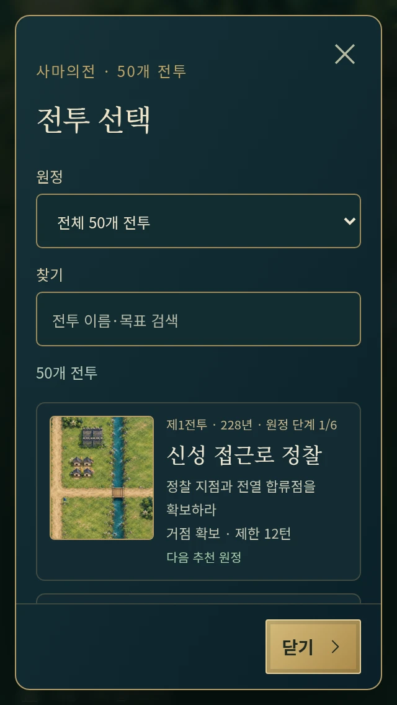
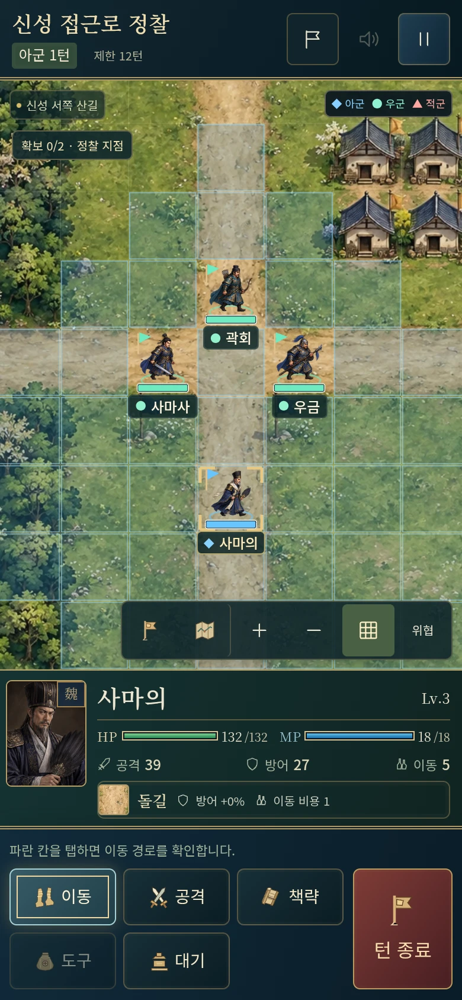
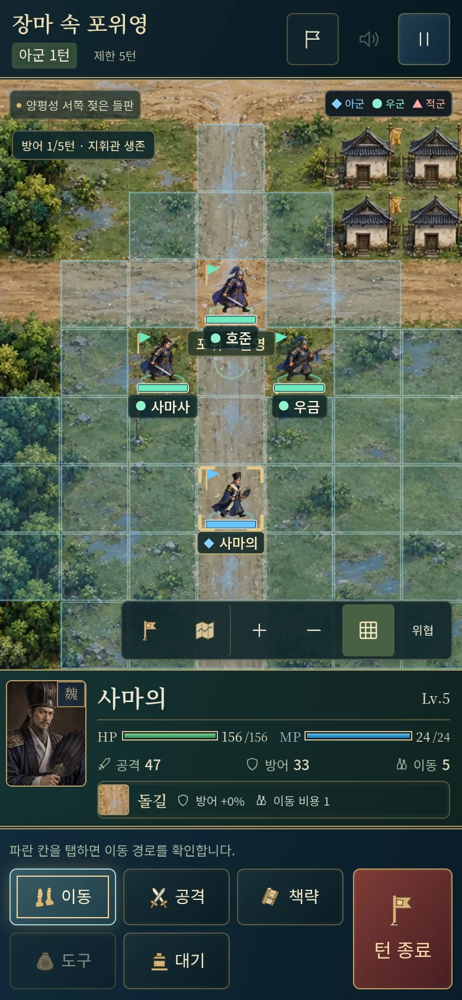

# 50개 전투의 일러스트 지도

기존 아홉 주요 전투의 일러스트를 유지하고 추가 **41개 전술 전투의 지도 아트를 개별 제작**했다. 50개 모두 별도 WebP이며 출력 SHA-256도 서로 다르다. [50개 전투의 이야기](SIMA_CAMPAIGN.md) · [UI·스토리·품질 QA](CAMPAIGN-50-QA.md)

## 지형과 아트

실제 18×12 등 지형 배열을 프로젝트 SVG로 시각화하고, 이를 참조해 새 일러스트를 만들었다. 전투 선택·출진 준비·배치창·전투·지형 미리보기가 같은 전투의 아트를 사용한다. 배치창은 실제 3×3 시작 영역을 확대하고 준비 지도는 전투의 칸 비율을 유지한다. 도로·강·다리·숲·절벽과 진영의 위치를 검토했다.

가정의 먼 산·절벽과 연락로의 과도한 건물 장식을 다시 제작했고, 건조한 두 지도에 생긴 물길도 없애 지형과 맞췄다. 소규모 풀·자갈은 장식이다. 나무·절벽 가장자리는 자연스럽게 퍼질 수 있으며 실제 이동 비용과 경계는 격자·지형 정보·행동 범위로 확인한다. 화공·비·부대·이름·거점은 실시간 레이어이고 배경에 영구적으로 그리지 않았다.

상용은 강과 성밖 진영, 가정·기산은 낮은 능선, 서성은 성밖 회군 도로, 상방곡은 건조한 황토 계곡, 오장원은 북쪽 방어선, 요동은 젖은 공성로, 고평릉은 낙양 석조 시설과 낙수, 양평관은 가을 숲으로 구성했다. 원정 안의 지도는 같은 지역의 분위기를 공유하면서 길목과 세부 아트를 달리한다.

## 파일·성능

- 생성 도구로 프로젝트 배치도를 참조해 독립 제작했다. 상업 게임에서 지도를 추출하지 않았다.
- PNG 원본 해상도를 유지하고 **WebP quality 90**으로 인코딩했다. 이미지 자르기·크기 변경·색 변경은 하지 않았다.
- 50장 합계 **33,453,550 bytes**. 원본 PNG 합계 183,574,486 bytes 대비 약 82% 감소했다. 한 파일은 모두 800,000 bytes 미만이며 목록은 지연 로딩·비동기 디코딩한다.
- `public/assets/battle-art.json`에 파일별 원본 이름·원본/출력 해시·해상도·용량을 기록한다.
- `node scripts/build-campaign-maps.ts`는 50개 전투의 아트 지시용 배치도를 `qa-artifacts/map-layouts/`에 만든다. 최종 일러스트를 덮어쓰지 않는다.

## 전체 지도 목록

| 번호 | 전투 | 지역 | 해상도 | 파일 크기 |
|---|---|---|---|---|
| 1 | 신성 접근로 정찰 | 신성 서쪽 산길 | 1536x1024 | 664,504 bytes |
| 2 | 격문 전달로 확보 | 신성 남쪽 역로 | 1536x1024 | 688,860 bytes |
| 3 | 급행군 보급선 | 신성 산 아래 보급영 | 1536x1024 | 641,486 bytes |
| 4 | 신성 외곽 전초전 | 신성 서문 외곽 | 1536x1024 | 698,148 bytes |
| 5 | 내응 연락선 | 신성 북쪽 연락로 | 1536x1024 | 690,226 bytes |
| 6 | 상용 급습전 | 상용 · 신성 성밖 | 1536x1024 | 722,600 bytes |
| 7 | 한중 보급로 탐색 | 가정 서쪽 산 아래 | 1536x1024 | 549,206 bytes |
| 8 | 장합 선봉 엄호 | 가정 협곡 입구 | 1536x1024 | 666,784 bytes |
| 9 | 산 아래 길목전 | 가정 남쪽 대로 | 1536x1024 | 612,658 bytes |
| 10 | 물길 접근전 | 가정의 좁은 수로 | 1536x1024 | 737,858 bytes |
| 11 | 가정 대로 우회 | 가정 동쪽 우회로 | 1536x1024 | 692,356 bytes |
| 12 | 가정 차단전 | 가정 · 산 아래 보급로 | 1536x1024 | 655,312 bytes |
| 13 | 서성 접근로 | 서성 외곽 도로 | 1536x1024 | 685,150 bytes |
| 14 | 열린 성문 경계 | 서성 남문 앞 들판 | 1536x1024 | 699,462 bytes |
| 15 | 성루 관측과 회군로 | 서성 서쪽 갈림길 | 1536x1024 | 600,172 bytes |
| 16 | 서성 후위 정비 | 서성 북서쪽 후위로 | 1536x1024 | 724,502 bytes |
| 17 | 서성 회군전 | 서성 · 성문 앞 | 1536x1024 | 673,328 bytes |
| 18 | 기산 방어선 구축 | 기산 서쪽 능선 | 1536x1024 | 611,518 bytes |
| 19 | 기산 보급영 방어 | 기산 숲 가장자리 | 1536x1024 | 694,108 bytes |
| 20 | 기산 협곡 전초전 | 기산 협곡 동쪽 | 1536x1024 | 574,464 bytes |
| 21 | 회군 징후 정찰 | 기산 동쪽 관측로 | 1536x1024 | 695,790 bytes |
| 22 | 기산 방어전 | 기산 · 위군 방어선 | 1619x972 | 610,822 bytes |
| 23 | 위수 남쪽 정찰 | 위수 남안 들판 | 1536x1024 | 660,928 bytes |
| 24 | 버려진 군량 접근전 | 상방곡 바깥 군량로 | 1536x1024 | 673,422 bytes |
| 25 | 골짜기 입구 호위 | 상방곡 좁은 입구 | 1536x1024 | 601,536 bytes |
| 26 | 상방곡 전열 유지 | 상방곡 안쪽 빈터 | 1536x1024 | 727,094 bytes |
| 27 | 상방곡 탈출전 | 상방곡 · 좁은 골짜기 | 1536x1024 | 671,964 bytes |
| 28 | 위수 북안 회군로 | 위수 북쪽 도로 | 1536x1024 | 633,666 bytes |
| 29 | 무공 방향 관측 | 오장원 동쪽 관측선 | 1536x1024 | 650,532 bytes |
| 30 | 북안 보급영 방어 | 오장원 서쪽 숲길 | 1536x1024 | 685,876 bytes |
| 31 | 오장원 전초 압박 | 오장원 북쪽 전초 | 1536x1024 | 605,580 bytes |
| 32 | 출전 조칙과 진영 | 오장원 지절 연락로 | 1536x1024 | 594,392 bytes |
| 33 | 오장원 대치전 | 위수 북쪽 방어선 | 1572x1001 | 695,040 bytes |
| 34 | 요동 진군로 확보 | 요동 서쪽 진군로 | 1536x1024 | 678,078 bytes |
| 35 | 요수 목책 정찰 | 요수 서쪽 관측영 | 1536x1024 | 718,364 bytes |
| 36 | 양평 우회 행군 | 요수 북쪽 우회로 | 1536x1024 | 656,632 bytes |
| 37 | 수산 길목 차단 | 수산 아래 전초로 | 1536x1024 | 684,090 bytes |
| 38 | 장마 속 포위영 | 양평성 서쪽 젖은 들판 | 1536x1024 | 664,944 bytes |
| 39 | 운제 접근로 | 양평성 서문 공성로 | 1536x1024 | 683,274 bytes |
| 40 | 요동 포위전 | 양평성 서쪽 | 1642x958 | 611,864 bytes |
| 41 | 낙양 소집로 | 낙양 서쪽 군영로 | 1536x1024 | 701,378 bytes |
| 42 | 성문 통제선 | 낙양 서쪽 성문 | 1536x1024 | 736,852 bytes |
| 43 | 군영 접관 통로 | 낙양 군영 앞 도로 | 1536x1024 | 648,378 bytes |
| 44 | 조상부 앞 호위로 | 낙양 무고 서쪽 접근로 | 1536x1024 | 691,096 bytes |
| 45 | 고평릉 정변 | 낙양 · 무고와 낙수 부교 | 1619x971 | 701,382 bytes |
| 46 | 옹주 원군 연락로 | 옹주 서쪽 군영로 | 1536x1024 | 646,256 bytes |
| 47 | 곡산 보급 차단 | 곡산 서쪽 전초로 | 1536x1024 | 693,754 bytes |
| 48 | 양평관 추격로 | 양평관 북쪽 갈림길 | 1536x1024 | 763,570 bytes |
| 49 | 양평관 후위 엄호 | 양평관 서쪽 협로 | 1536x1024 | 721,402 bytes |
| 50 | 양평관 회군전 | 양평관 · 연노 매복길 | 1619x971 | 662,892 bytes |

## 실제 게임 화면

최종 검증 결과와 발견한 문제의 수정·재검수는 [CAMPAIGN-50-QA.md](CAMPAIGN-50-QA.md)에 기록한다.
