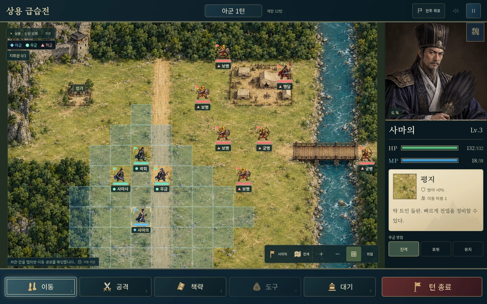
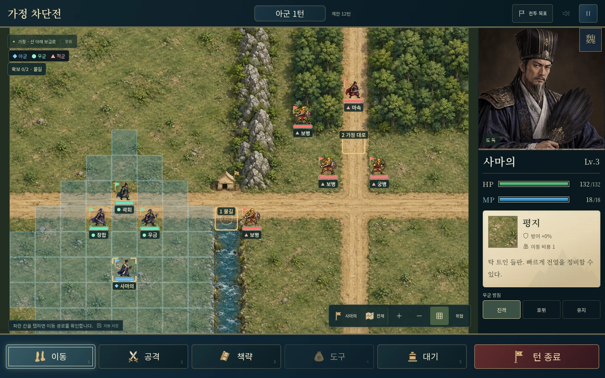
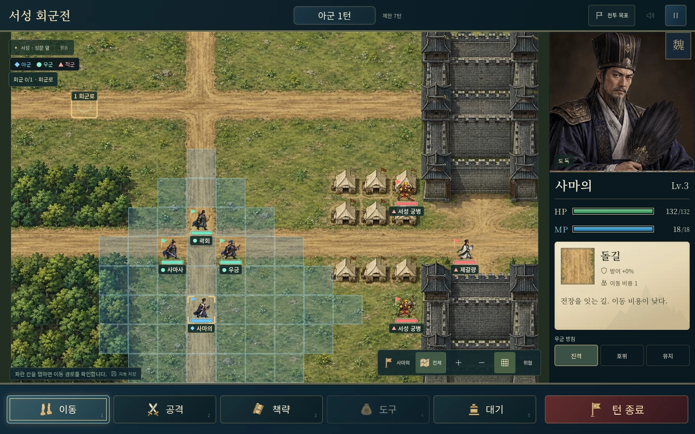
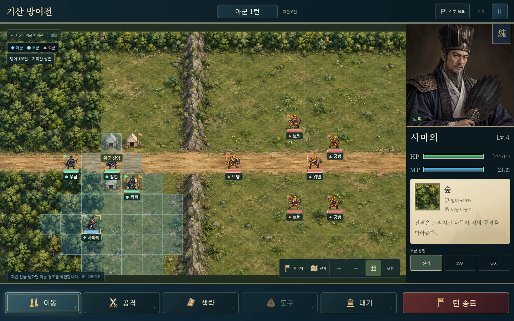
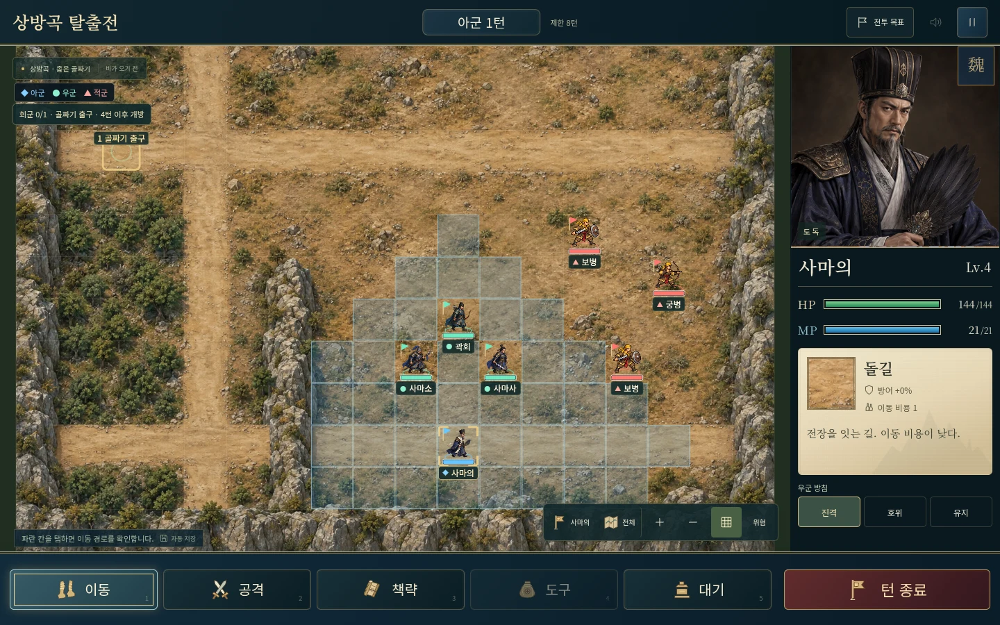
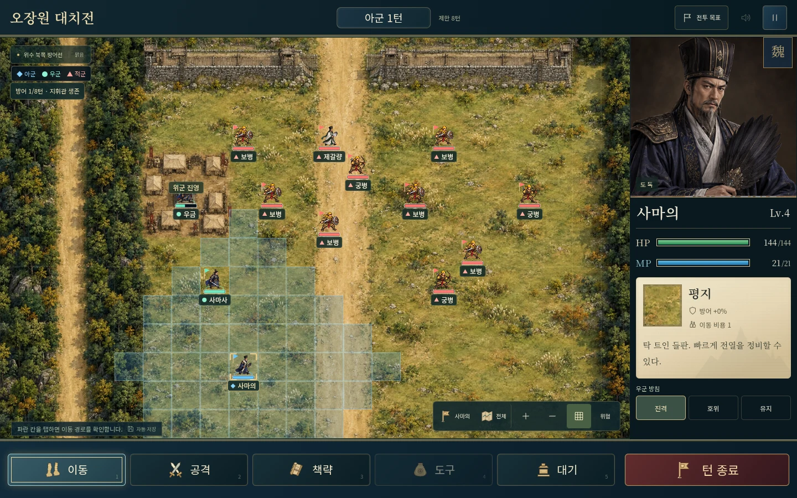
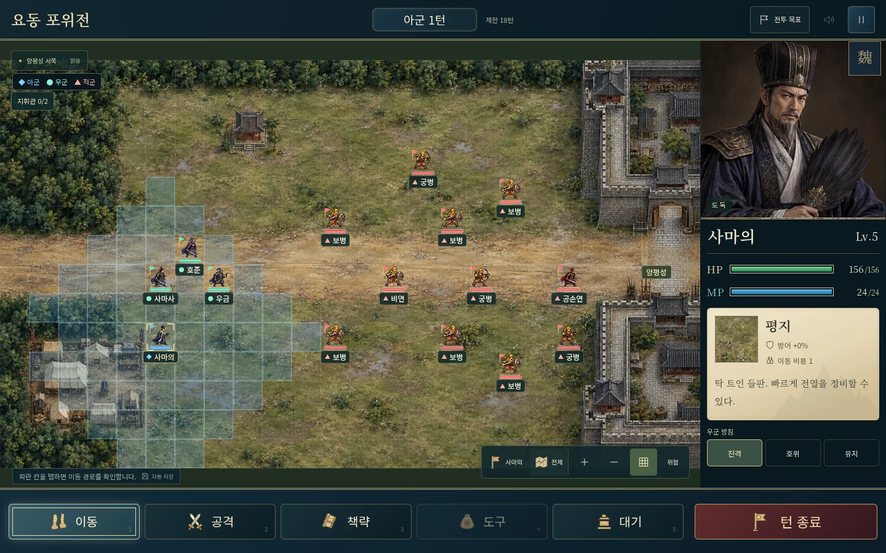
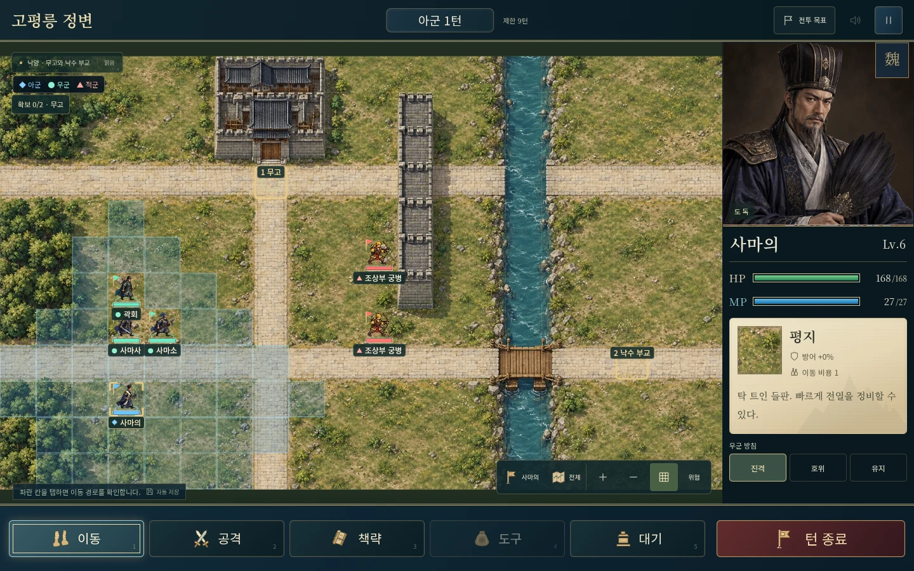
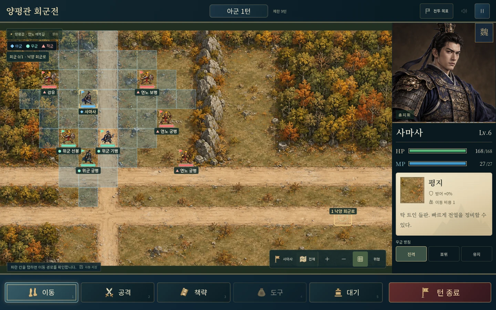

# 아홉 전장의 일러스트 교체

추가 여섯 전투가 단순 벡터 배경으로 남아 기존 세 전투와 품질이 달랐다. 기존 지도에도 그림과 실제 막힌 지형이 다른 부분이 있었다. 아홉 전투 모두 지형 배열을 참조해 새 일러스트를 제작하고 전투 선택·출진 준비·배치창·실제 전투·지형 미리보기에 적용했다.

지형 배열, 거점 좌표, 시작 배치와 저장 형식은 유지한다. 배경의 작은 돌과 낮은 풀은 장식이며 이동 비용은 게임의 지형 정보가 결정한다. 원화는 칸 배치를 기준으로 제작했지만 나무·절벽 가장자리는 자연스럽게 퍼질 수 있다. 정확한 행동 범위는 격자와 이동 표시로 확인한다.

## 제작과 적용

- 프로젝트 지형 배치도를 참조해 이미지 생성 도구로 독립 제작했다. 상업 게임의 지도나 그래픽을 추출하지 않았다.
- 불길·비·장수·이름·거점·행동 격자는 별도 실시간 레이어다. 상방곡에 불을 영구적으로 그리지 않았다.
- 새 `*-field.webp` 파일명을 사용해 과거 배경 캐시와 구별한다. 전투 목록 이미지는 지연 로딩한다.
- 출진 배치창은 실제 3×3 시작 영역을 확대한다. 준비 지도는 원정별 가로/세로 칸 비율을 사용한다.
- 생성 원본 PNG의 해상도를 유지하고 WebP quality 90으로 인코딩했다. 아홉 장 합계 **6,005,204 bytes**, 원본 PNG 합계 **31,998,825 bytes**보다 약 **81% 감소**했다. 원본 파일과 출력 해시는 `public/assets/battle-art.json`에 기록한다.
- `node scripts/build-campaign-maps.ts`는 아트 지시용 배치도를 `qa-artifacts/map-layouts/`에 만든다. 최종 일러스트를 덮어쓰지 않는다.

## 전장별 아트

| 전투 | 배경 구성 | 해상도 | 파일 크기 |
|---|---|---|---|
| 상용 | 민가·반란군 진영·동쪽 강과 다리 | 1536x1024 | 722,600 bytes |
| 가정 | 산 아래 물길과 보급로·북쪽 능선 | 1536x1024 | 655,312 bytes |
| 서성 | 열린 성문·성밖 회군로·수비 진영 | 1536x1024 | 673,328 bytes |
| 기산 | 좁은 산길·위군 진영·숲 방어선 | 1619x972 | 610,822 bytes |
| 상방곡 | 외곽 절벽·안쪽 골짜기·북서쪽 출구 | 1536x1024 | 671,964 bytes |
| 오장원 | 북쪽 방벽·중앙 도로·위군 진영 | 1572x1001 | 695,040 bytes |
| 요동 | 장마 뒤 젖은 평원·공성 진영·양평성 관문 | 1642x958 | 611,864 bytes |
| 고평릉 | 낙양 무고·성벽·낙수와 부교 | 1619x971 | 701,382 bytes |
| 양평관 | 가을 숲·매복 능선·동남쪽 회군로 | 1619x971 | 662,892 bytes |

## 실제 화면 검수

최종 로컬 검사: **전투 규칙 60개 통과, 브라우저 68개 통과, Pages용 빌드 통과**. 브라우저 아트 검사에서는 아홉 원정×세로 모바일/데스크톱의 18가지 조합으로 배경 파일의 정상 디코딩·파일 크기·준비 지도 비율·실제 배치 영역·전투 로딩·전체 지도 경계·회전을 검사한다. 별도로 다섯 환경×열 화면의 50가지 UI 회귀 검사를 다시 수행해 모두 통과했다. 자동 캡처를 눈으로 확인해 장수 대비·길목·성문·부교·전체 지도·미니 지도도 검토했다. 검사는 Chromium 뷰포트와 터치 에뮬레이션을 사용했다.

## 세로 화면과 화공

## 실제 전투 전체 지도

세로 화면은 확대 보기로 시작하고, 아래 데스크톱 검수 사진은 전체 지도 보기다. 장수·이름·격자는 실제 실행 중인 게임에서 표시한다.

### 상용

[배경 원화 보기](../../public/assets/shangyong-field.webp)

### 가정

[배경 원화 보기](../../public/assets/jieting-field.webp)

### 서성

[배경 원화 보기](../../public/assets/xicheng-field.webp)

### 기산

[배경 원화 보기](../../public/assets/qishan-field.webp)

### 상방곡

[배경 원화 보기](../../public/assets/shangfang-field.webp)

### 오장원

[배경 원화 보기](../../public/assets/wuzhang-field.webp)

### 요동

[배경 원화 보기](../../public/assets/liaodong-field.webp)

### 고평릉

[배경 원화 보기](../../public/assets/gaoping-field.webp)

### 양평관

[배경 원화 보기](../../public/assets/yangping-field.webp)
