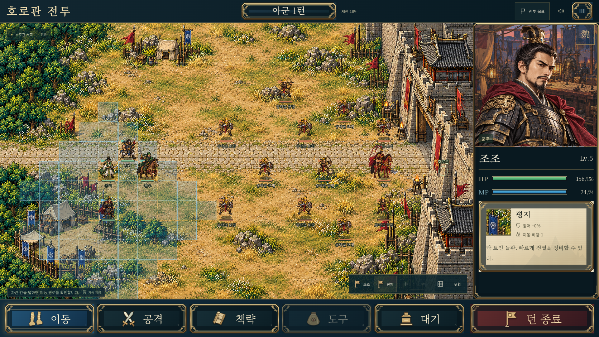

# 사수관·호로관 제작 기록

[공개 게임 실행](https://gnsyoo.github.io/threekingdom-jojo/). 제목 화면의 **전투 선택**에서 새 전투를 바로 시작할 수 있다. 영천 승리 → 사수관으로 진군 → 호로관으로 진군 순서도 연결했다.

## 사수관 구원전

22×14 지도, 제한 16턴, 화웅을 퇴각시키면 승리한다. 북쪽 관문으로 이어지는 돌길과 서쪽 숲길을 새로 제작했다. 조조·유비·장비가 남쪽에 출진하고 손견은 구원 진영에서 HP 48/108로 시작한다. 관우는 3턴 아군 차례에 서쪽에서 합류하며, 지원 위치가 점유됐으면 다음 아군 차례에 재시도한다.

조조가 부상한 우군과 인접하면 도구에서 회복 대상을 선택할 수 있다. 회복약은 HP 55를 회복하고 조조의 행동을 소비한다. 손견이 생존한 채 승리하면 보조 목표를 달성하며, 손견 퇴각 자체는 전투 패배가 아니다. 부상한 손견은 회복 진영을 지키며 가까운 적과 싸운다.

## 호로관 전투

24×14 지도, 제한 18턴, 여포를 퇴각시키면 승리한다. 동쪽 성문, 중앙의 넓은 평지, 서쪽 출진 지점을 새로 제작했다. 유비·관우·장비가 우군으로 함께 싸운다.

여포는 HP 260, 공격 44, 방어 36, 이동 6의 기병이다. 첫 두 턴은 위치를 지키며 인접한 적과만 싸우고, 3턴부터 진격한다. 진격 시점은 군의와 준비 화면에서 미리 알린다. 지휘관을 선택하면 주요 능력치를 볼 수 있고, 지도 도구의 **위협**을 켜면 이동 후 공격 가능한 칸을 표시한다. 유비·관우·장비 중 2명 이상이 생존하면 보조 목표를 달성한다.

## 모바일

기존 콘셉트의 명령·장수 정보 배치를 유지한다. 넓은 지도는 드래그·확대와 전체 보기로 확인한다. 이미지의 모바일 뷰포트는 844×390이며 실제 기기 성능을 측정한 결과는 아니다.

## 진행과 저장

각 확정 행동에 전투 ID, 좌표, 진영, 난수, 지원·진격 이벤트를 저장한다. 재개할 때 이벤트를 반복하거나 관우를 다시 회복시키지 않는다. 이전 영천 저장 파일은 그대로 불러올 수 있다.

승리 뒤 다음 전투의 군의·준비로 이동해도 이전 승리 기록을 유지하며, 새 출진을 확정할 때 마지막 전투 기록을 교체한다. 전투 선택의 승리 표시는 별도 캠페인 기록에 남는다. 저장 파일 내보내기는 마지막 전투를 대상으로 한다.

Lv.3 → Lv.4 → Lv.5와 HP/능력치는 이번 세 시나리오의 고정 시작값이다. 새 전투는 회복된 상태와 새 보급으로 시작한다. 전투 경험치 정산·장비 성장·6명 직접 조작은 이번 제작 범위에 포함하지 않았다.

## 검증 범위

- 코어 30개: 세 전투 완주, 전투별 지도·턴 제한·명단 검증, 인접 우군 회복, 지원 칸 점유, 이벤트 중복 방지, 저장 복귀와 기존 기록 호환.
- 브라우저 14개: 기존 영천 9개에 손견 회복·저장, 새 두 전투의 모바일 이벤트·복귀, 실제 버튼을 통한 사수관·호로관 승리와 다음 전투 연결을 추가했다.
- 위 30개·14개 테스트가 모두 통과했다. 새 두 보스의 실제 걷기·공격 프레임 전환도 확인했다. 테스트는 전투 상태를 강제로 승리로 바꾸지 않는다.
- Pages 경로로 빌드한 결과를 세 전투 × 데스크톱·모바일 터치의 6가지 경우로 확인했다. 영천의 2턴 화공과 두 관문의 3턴 이벤트 뒤 저장 복귀가 정상이며, 각각 23·26·26개 리소스가 정상 로드됐다. 여포를 선택한 정보창과 위협 표시도 확인했다. 실행 오류와 실패한 요청은 없었다.
