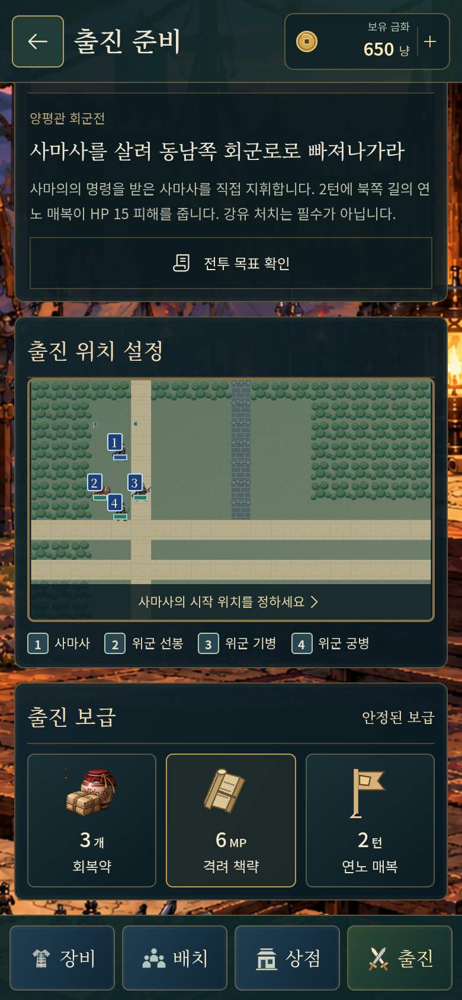
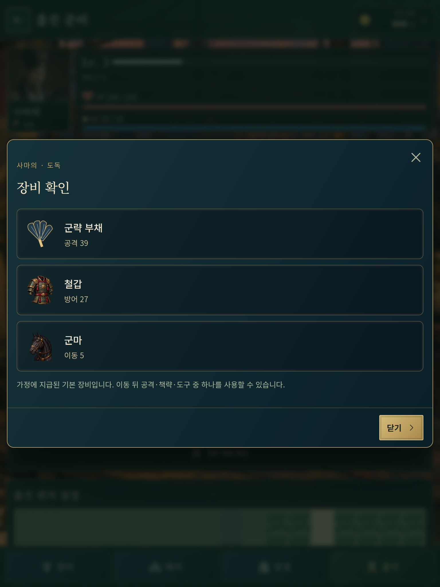

# 전체 연대기 · 50차 화면 검수와 QA

## 검증 범위

다섯 환경(320×568·390×844·844×390·768×1024·1440×900)에서 열 종류의 화면을 각각 검토했다. 아래 **50개는 서로 다른 실제 브라우저 화면 검수 사례**다. 자동 검사의 캡처를 추가로 눈으로 검토하고 문제를 수정했다. 50번 수동 플레이를 했다는 의미는 아니다.

`tests/browser/quality-50.spec.ts`는 실제 렌더링 후 버튼 내 글자 경계·명패 이름의 줄바꿈, 루트 가로 넘침, 초상/장비 SVG의 가로·세로 비율, 브라우저 예외·리소스 HTTP 오류를 검사한다. 화면별로 선택 상태, 장비 강화·준비 복귀, 44px 터치 버튼, 전투 우군 방침·위협·회전, 실제 터치 스와이프도 확인한다. 최대 메뉴 수·금액·엔딩 접근을 검토하기 위한 완료 목록 fixture를 사용한다. 승리 결과 fixture는 합법적인 규칙 행동으로 완료한 상태다. 패배 fixture는 화면 검사용이며 실제 플레이 완료 검증에 포함하지 않는다.

## 반복 검토와 수정

| 검토에서 발견한 내용 | 수정 |
|---|---|
| 짧은 세로의 서막 본문·출처 여백 부족 | 작은 높이에서 초상·패널 여백 조정, 본문 스크롤 유지 |
| 군의 ‘전략으로’ 대비 부족 | 밝은 문구와 어두운 단색 배경 |
| 844×390의 제목 메뉴가 화면 아래로 잘림 | 짧은 가로에서 2열 행동 메뉴와 제목 세로 스크롤 |
| 준비 미니 지도에 장수 이름·번호가 겹침 | 지도 칸 기준 축소와 지도 아래 번호·이름 목록 |
| 작은 서막에서 초상의 얼굴이 잘림 | 서막·종막 초상을 비율을 보존해 전체 표시 |
| 사마사의 긴 병과명 때문에 이름이 줄바꿈됨 | 세로 명패를 이름·병과 두 줄로 정리하고 이름은 한 줄로 검사 |
| 양평관 일반 우군 초상·보병 미니어처가 같은 기본값 | 병과별 초상 구분과 실제 전투 프레임에 맞는 미니어처 |
| 지도 전체 보기와 지휘관 위치의 아이콘이 같은 깃발로 보임 | 전체 보기는 접힌 지도 아이콘으로 구별 |
| 회군·확보 결과를 일반 전투 승리로 읽기 쉬움 | ‘임무 완료’와 회군/달성 표식 |
| 작은 지도에서 먼 거점 탐색이 어려움 | 목표 창의 거점 위치 보기 |

처음 결과 fixture 테스트가 실패한 원인은 전투 중 저장 주입 직후 `pagehide` 자동 저장이 fixture를 덮어쓴 것이었다. 제목으로 돌아간 뒤 fixture를 넣도록 테스트 준비를 고쳤다. 실제 저장 오류와 구별한다.

## 50개 최종 화면 사례

| 차수 | 환경 | 검토 화면 | 원정 | 결과 |
|---|---|---|---|---|
| 01 | 320×568 · 2배 | 제목·이어하기 | shangyong | 통과 |
| 02 | 320×568 · 2배 | 서막 | jieting | 통과 |
| 03 | 320×568 · 2배 | 종막·회고 | xicheng | 통과 |
| 04 | 320×568 · 2배 | 아홉 원정 목록 | qishan | 통과 |
| 05 | 320×568 · 2배 | 군의 | shangfang | 통과 |
| 06 | 320×568 · 2배 | 전략 선택 | wuzhang | 통과 |
| 07 | 320×568 · 2배 | 출진 준비 | liaodong | 통과 |
| 08 | 320×568 · 2배 | 장비·강화·보급 | gaoping | 통과 |
| 09 | 320×568 · 2배 | 전장·명령·회전 | yangping | 통과 |
| 10 | 320×568 · 2배 | 목표 달성·패배 | shangyong | 통과 |
| 11 | 390×844 · 2배 | 제목·이어하기 | jieting | 통과 |
| 12 | 390×844 · 2배 | 서막 | xicheng | 통과 |
| 13 | 390×844 · 2배 | 종막·회고 | qishan | 통과 |
| 14 | 390×844 · 2배 | 아홉 원정 목록 | shangfang | 통과 |
| 15 | 390×844 · 2배 | 군의 | wuzhang | 통과 |
| 16 | 390×844 · 2배 | 전략 선택 | liaodong | 통과 |
| 17 | 390×844 · 2배 | 출진 준비 | gaoping | 통과 |
| 18 | 390×844 · 2배 | 장비·강화·보급 | yangping | 통과 |
| 19 | 390×844 · 2배 | 전장·명령·회전 | shangyong | 통과 |
| 20 | 390×844 · 2배 | 목표 달성·패배 | jieting | 통과 |
| 21 | 844×390 · 2배 | 제목·이어하기 | xicheng | 통과 |
| 22 | 844×390 · 2배 | 서막 | qishan | 통과 |
| 23 | 844×390 · 2배 | 종막·회고 | shangfang | 통과 |
| 24 | 844×390 · 2배 | 아홉 원정 목록 | wuzhang | 통과 |
| 25 | 844×390 · 2배 | 군의 | liaodong | 통과 |
| 26 | 844×390 · 2배 | 전략 선택 | gaoping | 통과 |
| 27 | 844×390 · 2배 | 출진 준비 | yangping | 통과 |
| 28 | 844×390 · 2배 | 장비·강화·보급 | shangyong | 통과 |
| 29 | 844×390 · 2배 | 전장·명령·회전 | jieting | 통과 |
| 30 | 844×390 · 2배 | 목표 달성·패배 | xicheng | 통과 |
| 31 | 768×1024 · 2배 | 제목·이어하기 | qishan | 통과 |
| 32 | 768×1024 · 2배 | 서막 | shangfang | 통과 |
| 33 | 768×1024 · 2배 | 종막·회고 | wuzhang | 통과 |
| 34 | 768×1024 · 2배 | 아홉 원정 목록 | liaodong | 통과 |
| 35 | 768×1024 · 2배 | 군의 | gaoping | 통과 |
| 36 | 768×1024 · 2배 | 전략 선택 | yangping | 통과 |
| 37 | 768×1024 · 2배 | 출진 준비 | shangyong | 통과 |
| 38 | 768×1024 · 2배 | 장비·강화·보급 | jieting | 통과 |
| 39 | 768×1024 · 2배 | 전장·명령·회전 | xicheng | 통과 |
| 40 | 768×1024 · 2배 | 목표 달성·패배 | qishan | 통과 |
| 41 | 1440×900 · 1배 | 제목·이어하기 | shangfang | 통과 |
| 42 | 1440×900 · 1배 | 서막 | wuzhang | 통과 |
| 43 | 1440×900 · 1배 | 종막·회고 | liaodong | 통과 |
| 44 | 1440×900 · 1배 | 아홉 원정 목록 | gaoping | 통과 |
| 45 | 1440×900 · 1배 | 군의 | yangping | 통과 |
| 46 | 1440×900 · 1배 | 전략 선택 | shangyong | 통과 |
| 47 | 1440×900 · 1배 | 출진 준비 | jieting | 통과 |
| 48 | 1440×900 · 1배 | 장비·강화·보급 | xicheng | 통과 |
| 49 | 1440×900 · 1배 | 전장·명령·회전 | qishan | 통과 |
| 50 | 1440×900 · 1배 | 목표 달성·패배 | shangfang | 통과 |

검수 캡처와 JSON은 기본 `qa-artifacts/chronicle/`에 저장한다. `QA_ARTIFACT_DIR` 환경 변수로 다른 경로를 지정할 수 있다.

## 규칙과 실제 진행

전체 브라우저 94개가 통과했고, 마지막 명패·일반 우군 표시를 보정한 뒤 영향 범위의 50개 화면과 준비/양평관 진행을 다시 검사해 52개 모두 통과했다. 지도 전체 보기 아이콘을 구별한 뒤 전투 화면 다섯 환경도 다시 확인했다.

- 규칙 검사 60개: 기존 규칙과 신규 거점·순서·비/화공·대기·격려·방침·강화·저장 검증. 아홉 임무×두 전략×세 난수 조건의 **54회 합법적인 규칙 완주**를 포함하며 각 행동 뒤 저장을 다시 파싱했다.
- 신규 브라우저 검사 12개: 서막/군의 커서, 준비의 강화·보급·배치, 세 종류의 종막 회고와 같은 원전 결말, 손상 기록, 거점 카메라, 추가 여섯 임무의 **실제 UI 행동 완주와 저장·후일담·다음 이야기/종막 연결**.
- 기존 브라우저 검사 32개: 이동·공격 동작, 칸 경계·글자·회전·실제 스와이프, 원전 대화, 기존 세 원정과 준비·전투 저장 회귀 검사.

UI 완주에서는 시작 배치·HP·좌표·승패를 주입하지 않는다. 읽기 전용 개발 상태로 전술 선택을 계산한 다음 실제 이동·확정·공격·도구·대기·턴 종료 버튼과 지도 입력으로 진행한다. 작은 화면의 지도 가림은 실제 드래그로 위치를 옮겨 해결한다. 저장 후 다시 불러온 사건·목표·HP·좌표가 같은지도 확인한다.

이 검수는 Chromium과 모바일 뷰포트/터치 에뮬레이션이다. 네이티브 Android/iOS 실기기·발열·장기 성능 검사를 대신하지 않는다. 공개 Pages 배포 후에도 실제 배포 리소스와 모바일 화면을 별도로 확인한다.

## 캡처 검토

