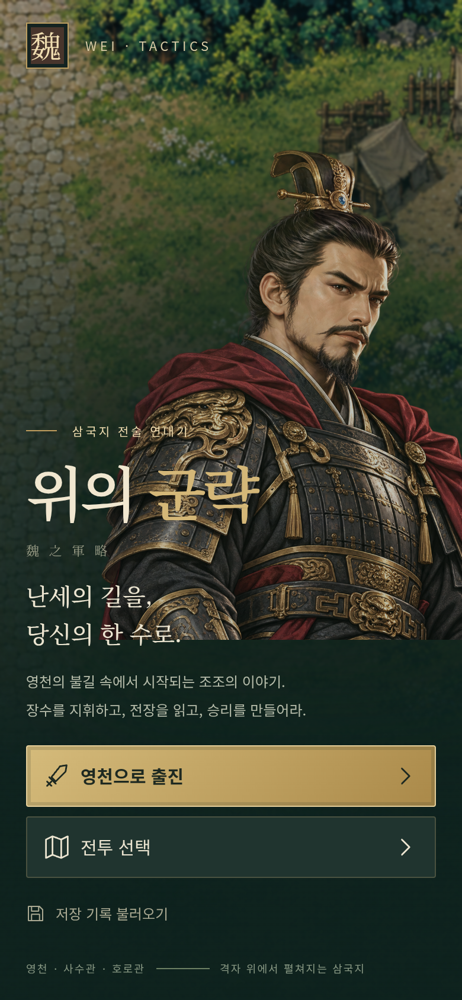
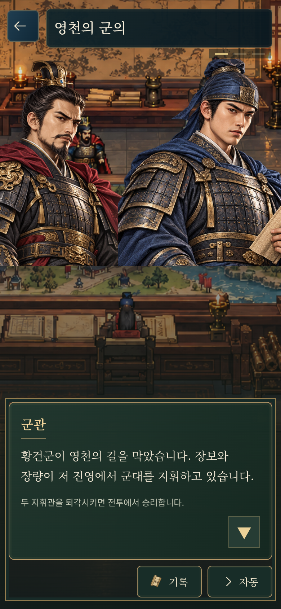
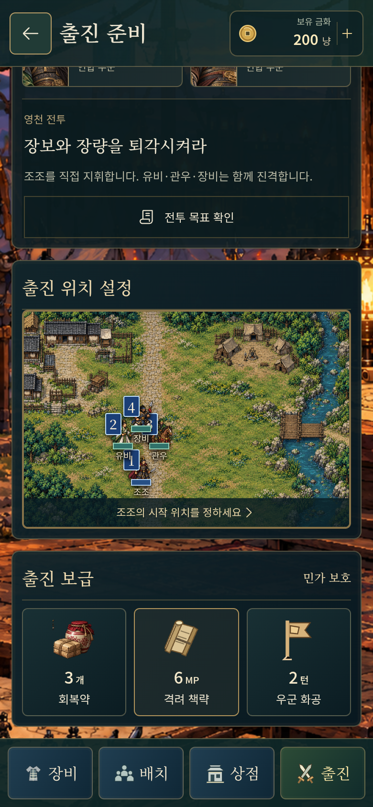
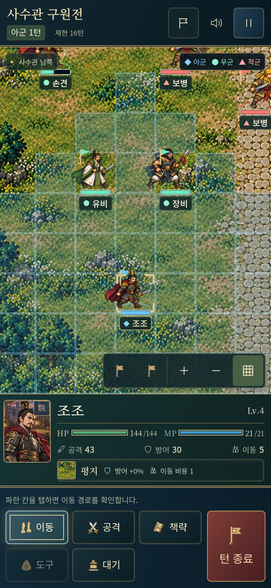
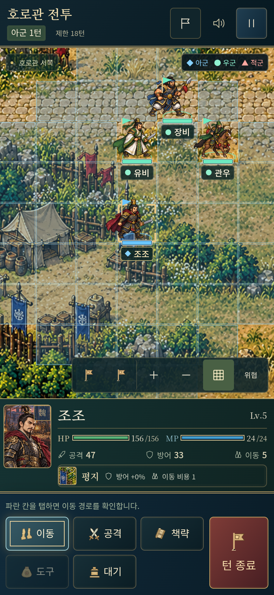

# 세로 화면·가독성 개선

[공개 게임](https://gnsyoo.github.io/threekingdom-jojo/). 페이지를 새로고침하면 세로 화면에 맞춘 배치를 볼 수 있다.

추가 개선은 [UI·그래픽 검수 기록](UI-REVIEW.md)에 정리했다. 전략 선택 카드, 비율을 보존하는 초상·장비 아이콘, 큰 금액 표시, 선명한 전투 이름표, 같은 높이의 부대와 고해상도 렌더링을 적용했다.

## 시작과 군의

시작 버튼은 화면 폭에 맞추고, 저장 기록이 생겨 버튼이 늘어날 때는 화면을 스크롤할 수 있다.

군의실의 목재·금색·짙은 녹색과 이어지는 대화창을 사용한다. 발화자, 본문, 안내, 다음 버튼은 한 패널 안에서 자연스럽게 배치한다. 전략 선택에는 별도 제목, 설명, 효과 표시와 선택 체크를 둔다. 세로에서는 선택지와 대화창을 아래쪽에 쌓고 기록·자동 버튼을 별도 줄에 둔다. 짧은 세로 화면에서는 선택 확정 버튼을 하단에 고정하고 긴 대화는 스크롤하며 읽는다. 배경·초상 이미지는 기존 원본을 유지하며, 배경 덮개와 패널 재질을 화면에서 합성한다.

## 출진 준비

선택 장수의 초상·레벨·HP/MP와 장비를 먼저 보여 주고, 무장 목록, 목표, 출진 지도, 보급을 이어서 표시한다. 장비·배치·상점·출진은 하단에 고정한다. 군의로 돌아가는 버튼은 세로 화면의 상단에 둔다.

지도의 가로세로 비율은 각 전투의 칸 수에 맞춘다. 길쭉하게 늘어나던 지형과 부대가 원래 비율로 보인다. 본문을 스크롤해도 출진 메뉴는 계속 사용할 수 있다.

## 전투

지도 아래에 선택 장수의 초상·체력·기력·공격·방어·이동·지형 정보를 항상 표시한다. 명령은 두 줄로 배치하고 턴 종료는 별도 큰 버튼으로 둔다. 가로로 돌리면 정보창이 다시 오른쪽으로 이동한다. 실제 지도 영역의 크기를 관찰해 캔버스와 터치 좌표를 함께 조정한다.

장수 주변의 검은 효과와 발밑의 불투명한 그림자는 제거했다. 전장 배경의 밝기는 원본에 가깝게 두고 소폭만 낮춘다. 채우지 않은 얇은 발밑 표시와 깃발은 아군 파랑·우군 민트·적군 붉은색으로 표시한다. ◆·●·▲ 모양과 반투명 이름표를 함께 사용해 색상 외에도 진영을 구별한다. 행동한 장수를 지나치게 흐리게 표시하지 않는다. 지도 이동·확대·전체 보기와 기존 걷기·공격 동작은 유지한다.

## 검증

- 휴대폰 320×568, 390×844, 412×915와 태블릿 768×1024에서 버튼 글자 넘침과 가로 스크롤 검사를 통과했다.
- 준비 지도 비율, 하단 명령의 최소 44px 크기, 장비·배치·상점, 세 전투의 이벤트와 저장 재개 검사를 통과했다.
- 세로 → 가로 → 세로 회전 뒤 캔버스 폭, 이동·되돌리기·확대·터치 드래그와 저장 상태 검사를 통과했다.
- 최신 개선에서는 관련 브라우저 검사 16개, 폰트 보완 뒤 UI·그래픽 재검사 7개, 코어 30개, 타입 검사와 Pages 경로 빌드를 확인했다. 직접 화면 검수 20건과 화면 크기별 40개 상태의 반복 검사 내역은 [검수 기록](UI-REVIEW.md)에 있다.

이미지는 실제 실행 화면을 390×844 뷰포트에서 촬영했다. 물리적인 휴대폰 성능이나 네이티브 패키징을 검증한 결과는 아니다.
