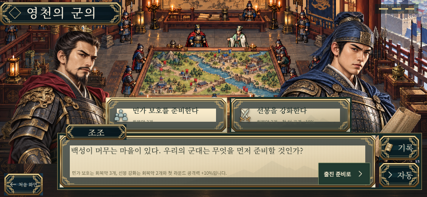
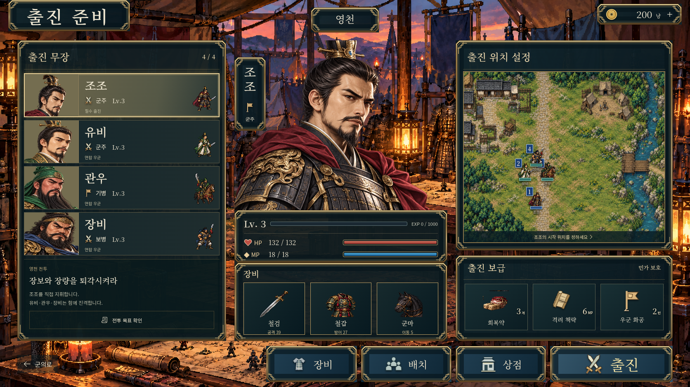
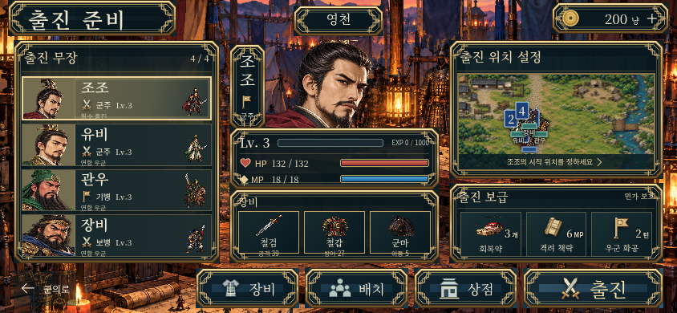

# 영천 전투 — 콘셉트 반영 버전

아래는 실제 웹 게임을 실행해 촬영한 화면이다. [공개 게임 실행](https://gnsyoo.github.io/threekingdom-jojo/).

## 군의와 대화

군의실 도트 배경, 양쪽 인물 초상, 중앙 선택지, 하단 종이 대화창, 오른쪽 기록·자동 버튼을 콘셉트 위치에 배치했다. 자동 재생은 선택지에서 멈추며, 출진 방침을 고르고 확인해야 준비 화면으로 넘어간다.

## 출진 준비

[승인된 출진 준비 콘셉트](../design/images/preparation.png)의 3단 구성을 구현했다. 왼쪽은 출진 무장 목록, 중앙은 선택 장수의 큰 초상·레벨·경험치 초기값·HP/MP·장비 카드, 오른쪽은 출진 위치 지도와 보급품이다. 하단에는 장비·배치·상점·출진 메뉴를 배치했다.

현재 전투의 실제 출진 명단인 조조·유비·관우·장비와 시작 능력치를 표시한다. 장비는 기본 장비 정보를 확인할 수 있다. 배치는 조조의 시작 지역 9칸 중 한 곳을 선택하고 확정한다. 상점은 출진 지원금 200냥, 회복약 구매 100냥·되팔기 50냥·지참 한도 3개를 적용한다. 구매와 배치는 메뉴를 오가도 유지하고 출진할 때 저장한다.

모바일 가로에서도 같은 3단 구성과 메뉴 순서를 유지한다. 메뉴 버튼은 최소 44px 크기다.

## 전투

상단 전투명·턴 표시, 오른쪽 장수 초상·HP/MP·종이 지형 정보, 하단 이동·공격·책략·도구·대기와 별도의 턴 종료 버튼을 콘셉트 구조로 배치했다. 지형 정보는 선택 장수의 실제 위치에 따라 바뀐다.

지도는 드래그·휠·두 손가락으로 이동·확대할 수 있다. 전체 보기로 모든 부대를 확인할 수 있다.

## 부대 동작

8종 부대의 걷기 4포즈·공격 4포즈, 총 64개 새 프레임을 사용한다. 부대는 이동 경로의 각 칸을 따라 걸으며, 이동 완료 후 공격 자세와 짧은 전진 동작을 재생한다. 타격 자세에서 피격·회피·피해 표시를 내보내고, 반격은 선행 공격이 끝난 뒤 재생한다. 궁병은 화살을 발사하고 체력이 0인 부대는 사라진다.

AI의 다음 행동과 승패 화면은 실제 동작 완료를 기다린다. 빠른 속도 설정도 모든 공격 자세를 순서대로 재생한다. 현재 좌우 방향은 반전으로 제공하며 독립된 4방향 동작은 후속 제작 범위다.

## 검증

코어 20개와 브라우저 9개 모두 통과했다. 브라우저 완주 검증은 상태를 강제로 바꾸지 않고 실제 버튼과 합법적인 이동·공격·회복·턴 종료로 진행한다.

- 전술 코어 20개: 이동·행동·AI·승패·저장·완주, 시작 위치 제한, 보급 예산·한도, 준비한 상태의 저장과 이동 되돌리기.
- 브라우저 9개: 모바일 화면·명령 크기, 이동·취소·저장 복귀, AI 중단 복귀, 실제 전투 완주·저장된 승리 재실행, 백업 복구, 터치 이동·드래그, 준비 메뉴·구매·배치 상태 유지, 대화 자동·기록, 걷기 프레임 전환과 공격·피격 재생.
- TypeScript 검사와 Pages 경로의 프로덕션 빌드.
- Pages 경로의 프로덕션 화면에서 데스크톱·모바일 터치로 출진 → 2라운드 화공 → 저장 복귀를 확인했다. 각 환경의 리소스 21개가 정상 로드됐고, 실행 오류·실패한 요청은 없었다. 개발용 조회 기능도 제외됐다.

스크린샷은 데스크톱 1672×941, 모바일 844×390 뷰포트다. 실제 휴대폰 성능 측정 결과는 아니다.

## 현재 범위

영천 1전투와 출진 준비를 구현했다. 조조를 직접 지휘하고 우군 3명은 AI가 행동한다. 경험치 지급, 장비 교체·강화, 승급·전리품 정산, 사수관 이후 전투, Android/iOS 네이티브 패키징은 다음 제작 범위다.
