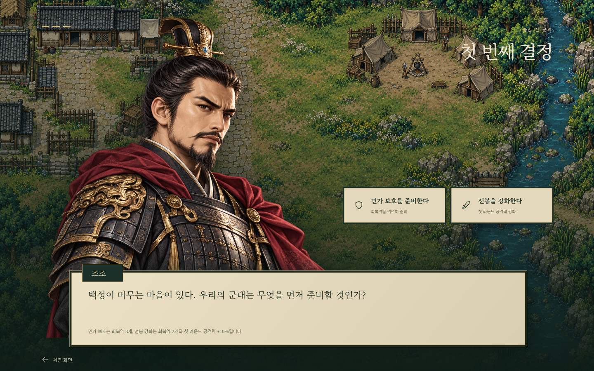
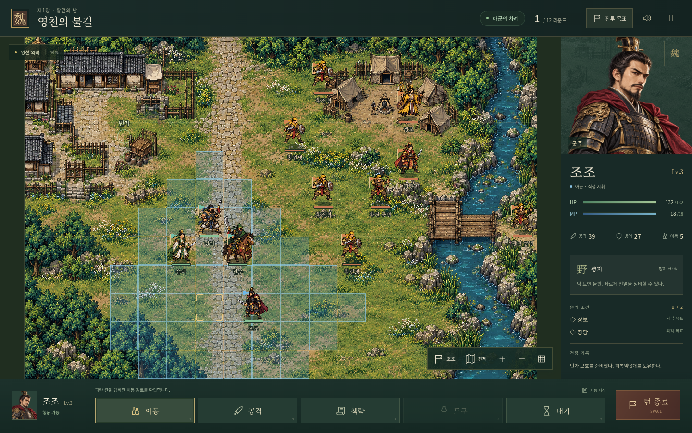
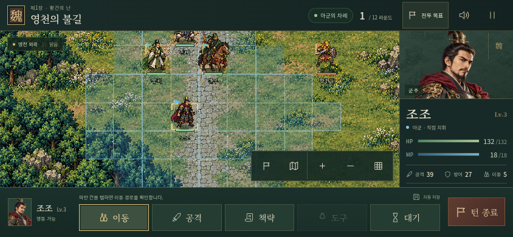
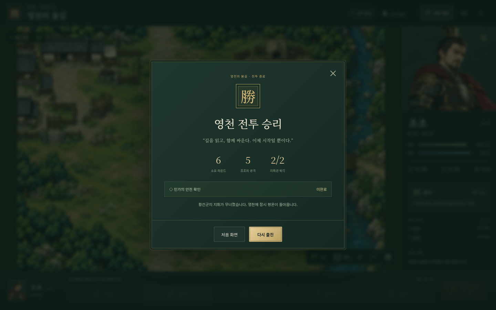

# 첫 제작 — 영천 전투 v0.1

기획 이미지가 아니라 **실제로 실행한 웹 게임 화면**이다. 첫 전투의 조작·전술·저장 흐름을 검증했다.

## 제목 화면

## 이야기와 출진 선택

민가 보호는 회복약을 추가하고, 선봉 강화는 첫 라운드 공격력을 높인다. 선택 후 영천 전투로 진입한다.

## 데스크톱 전투

## 모바일 가로 화면

지도는 확대된 상태에서 시작한다. 전장을 드래그하거나 전체 보기로 바꾸어 다른 부대를 확인한다. 모바일에서도 명령 버튼은 최소 44px 이상이다.

## 전투 승리

브라우저 자동 플레이는 상태를 강제로 바꾸지 않고 실제 이동·공격·회복·턴 종료 버튼을 사용했다. 6라운드에 승리했고 조조가 5회 공격했다. 결과 화면과 저장된 승리 상태의 재실행을 확인했다.

## 검증

- 전술 코어 17개: 모두 통과, 건너뛴 테스트 없음.
- 브라우저 6개: 모바일 레이아웃·목표창·버튼 크기, 이동 미리보기/취소/저장 복귀, AI 차례 중 복귀, 실제 전투 완주·승리 재실행, 손상된 기록의 백업 복구, 터치 탭 이동·드래그 시 명령 방지.
- TypeScript 검사와 프로덕션 빌드 통과.
- 프로덕션 빌드도 실제 버튼으로 2라운드까지 진행해 화공 이벤트를 확인했다. 실행 오류·실패한 리소스 요청·외부 HTTP 요청은 없었고 개발용 상태 조회 기능은 포함되지 않았다.
- 새 전장·초상·부대 이미지와 한글 폰트를 앱 내부 리소스로 제공.

이 기록의 모바일 이미지는 844×390 가로 뷰포트다. 실제 휴대폰에서의 성능을 측정한 결과는 아니다.

## 기획안에서 구체화한 값

- 조조 시작 위치는 배경의 열린 길목에 맞춰 `(6,9)`로 조정했다.
- 민가의 위치는 실제 배경의 마당에 맞춰 `(3,3)`으로 조정했다.
- 조조 Lv.3, HP 132, MP 18, 공격 39, 방어 27. 지형·상성·명중·반격을 적용한다.
- 18×12 지도, 적장 2명과 일반병·궁병 6명, 우군 3명, 제한 12라운드.
- 출진 전 두 선택은 회복품 또는 첫 라운드 공격 강화에 영향을 준다.
- 장비 성장·전리품은 이번 첫 전투에서 정산하지 않는다. 결과에는 승패·라운드·공격·보조 목표를 표시한다.

## 남은 제작

전술 판정과 모바일 조작의 기반을 마련했다. 다음 제작 단위는 장수별 방향·공격 프레임, 추가 인물 초상, 출진·장비·성장, 사수관 2번째 전투다. Android/iOS 앱 빌드는 이 웹 버전의 조작 검토 후 진행할 수 있다.
