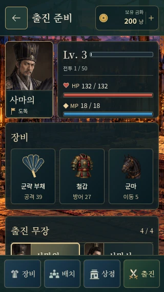
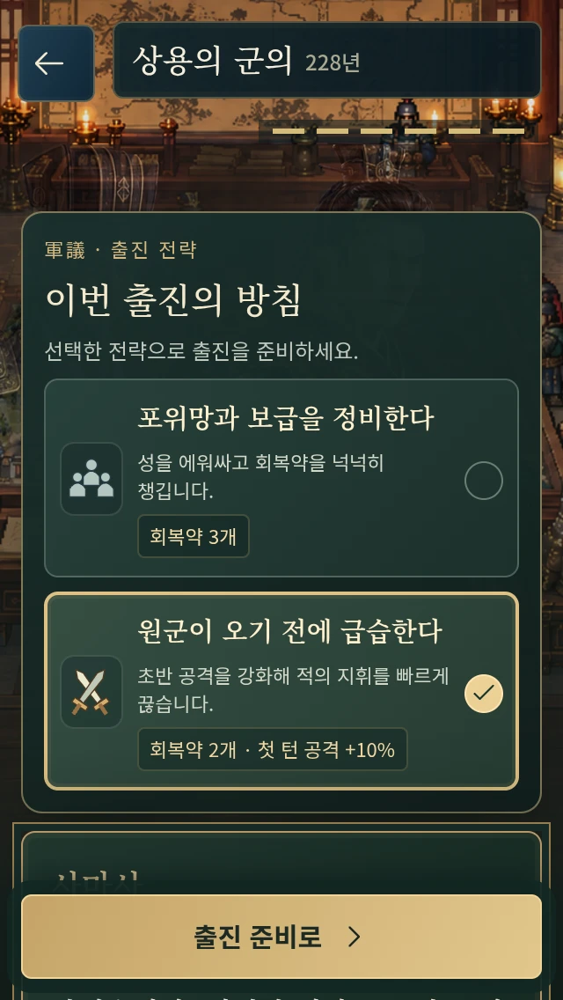
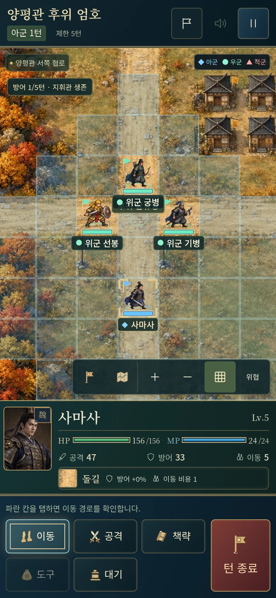
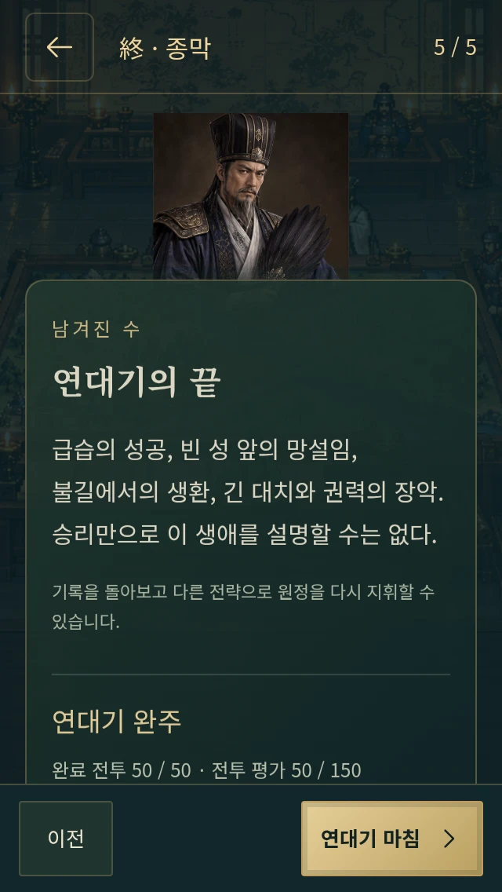

# 사마의전 구현 화면

[게임 실행](https://gnsyoo.github.io/threekingdom-jojo/) · [전체 구현 대사와 원정](SIMA_CAMPAIGN.md) · [50개 전투 확장 QA](CAMPAIGN-50-QA.md) · [50개 전장 아트](BATTLE-ART.md)

220년 서막부터 아홉 원정의 50개 전투를 거쳐 251년 종막까지 진행한다. 삼국연의의 사건·실패·유언을 유지하고 마지막 생각 두 문장만 짧게 각색했다.

현재 화면·기능·검증은 위 문서를 기준으로 한다. 이전 조조편과 세 원정 시절의 이미지·검수 기록은 개발 이력으로 보관한다.
