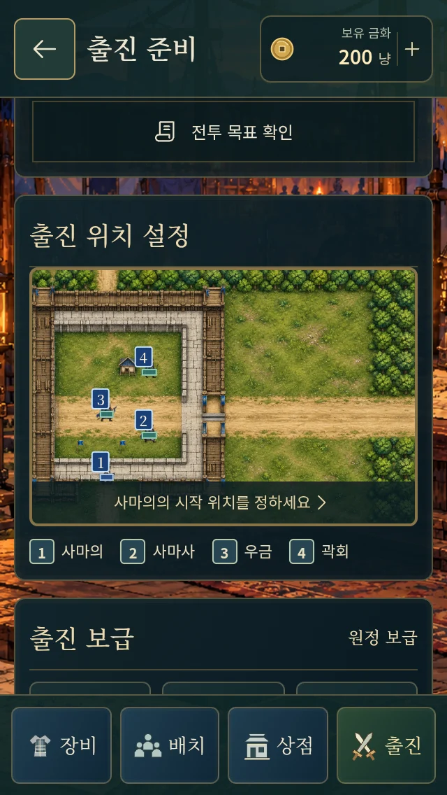
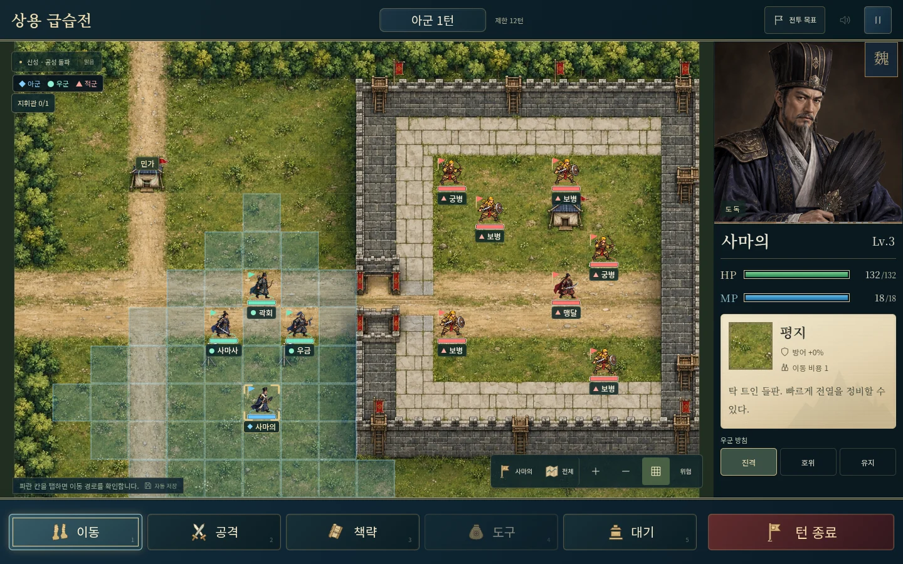
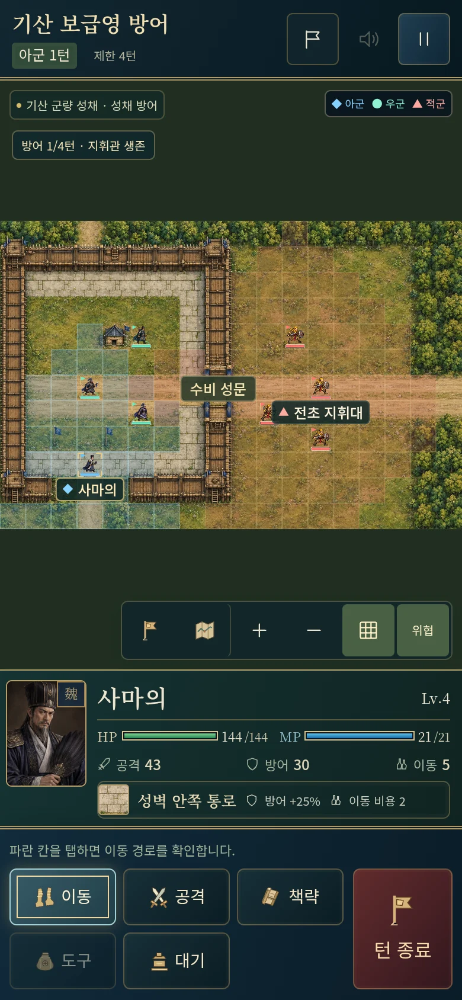
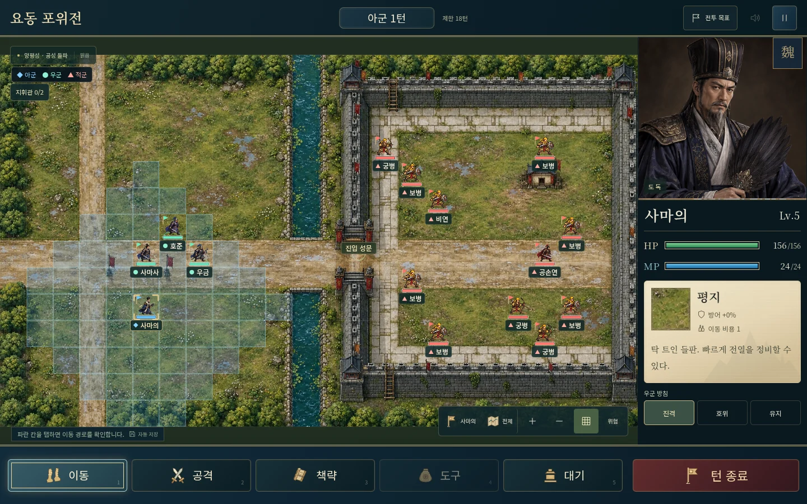

# 공성전 15개 · 지도·스토리·저장 검증

50개 전투 중 **15개(30%)**를 공성전으로 구성했다. 공성 돌파 4개, 성채 방어 7개, 포위 공방 4개다. 야전 35개를 포함한 기존 50개 연대기와 결말을 유지한다. [게임](https://gnsyoo.github.io/threekingdom-jojo/) · [실제 전체 대사](SIMA_CAMPAIGN.md) · [현재 아트 목록](BATTLE-ART.md)

## 전투 구성

| 번호 | 원정·전투 | 성채 | 방식 | 승리 조건 |
|---|---|---|---|---|
| 3 | 급행군 보급선 | 신성 보급 성채 | 성채 방어 | 지휘관을 지키며 3턴까지 버텨라 |
| 4 | 신성 외곽 전초전 | 신성 외곽 보루 | 공성 돌파 | 성문의 좁은 통로를 넘어 전초 지휘대를 제압하라 |
| 5 | 내응 연락선 | 신성 북문 | 포위 공방 | 성문 앞 연락점과 포위 합류점을 차례로 확보하라 |
| 6 | 상용 급습전 | 신성 | 공성 돌파 | 맹달을 제압하라 |
| 18 | 기산 방어선 구축 | 기산 전선 보루 | 포위 공방 | 성문 앞 연락점과 포위 합류점을 차례로 확보하라 |
| 19 | 기산 보급영 방어 | 기산 군량 성채 | 성채 방어 | 지휘관을 지키며 4턴까지 버텨라 |
| 22 | 기산 방어전 | 기산 위군 보루 | 성채 방어 | 사마의를 지키며 6턴까지 버텨라 |
| 30 | 북안 보급영 방어 | 위수 북안 군량 성채 | 성채 방어 | 지휘관을 지키며 4턴까지 버텨라 |
| 33 | 오장원 대치전 | 위수 북쪽 보루 | 성채 방어 | 사마의를 지키며 8턴까지 버텨라 |
| 35 | 요수 목책 정찰 | 요수 목책 성채 | 포위 공방 | 지휘관을 지키며 5턴까지 버텨라 |
| 38 | 장마 속 포위영 | 양평 포위 성채 | 성채 방어 | 지휘관을 지키며 5턴까지 버텨라 |
| 39 | 운제 접근로 | 양평 동남문 | 포위 공방 | 성문 앞 연락점과 포위 합류점을 차례로 확보하라 |
| 40 | 요동 포위전 | 양평성 | 공성 돌파 | 공손연과 비연을 제압하라 |
| 47 | 곡산 보급 차단 | 곡산 전초 성채 | 공성 돌파 | 성문의 좁은 통로를 넘어 전초 지휘대를 제압하라 |
| 49 | 양평관 후위 엄호 | 양평관 후위 보루 | 성채 방어 | 지휘관을 지키며 5턴까지 버텨라 |

## 원전과 전술 구성

원전의 원정 안에 보급·전초 성채를 배치하는 게임용 재구성이다. 서로 다른 역사적 도시 15개를 사마의가 함락했다고 주장하지 않는다. 신성 외곽 전투와 연락점 확보는 본성 함락 이전이며 맹달의 결말은 마지막 신성 전투에 남긴다. 요수 목책은 본대의 우회 시간을 벌고, 양평 포위 중 장마·출격을 견디다가 마지막 전투에서 공손연·비연의 결말로 이어진다.

서성은 열린 성문의 공성계에 속아 회군한다. 오장원은 제갈량을 처치하지 않고 8턴까지 버티며, 그의 죽음과 목상 계책은 원정 마지막 후일담이다. 곡산 전초 전투에 구안의 항복을 앞당기지 않았다. 후위 보루의 사마사는 아직 드러나지 않은 양평관 연노 매복을 미리 알지 못한다. 고평릉 이후와 251년 종막은 기존 이야기대로다.

## 실제 공성 규칙과 화면

- 성벽은 통행·사격 불가. 성문 이동 비용 1·방어 +15%, 성벽 안쪽 통로 이동 비용 2·방어 +25%.
- 우군·적군의 진격은 공격 가능한 위치까지 성문을 거치는 지형 경로를 계산한다. 위협 범위도 성벽의 사격 차단을 반영한다.
- 성문은 열린 통행 칸이다. 성문 파괴 HP나 운제·투석기 직접 조작은 포함하지 않는다.
- 원정 기록의 공성전/야전 필터는 원정 분류·검색과 함께 작동한다. 전투 목표의 성문 위치 보기로 지도 초점을 옮긴다.
- 지도 변경 전 저장은 새 벽·물 위 부대만 가까운 빈 통행 칸으로 옮기며 HP·MP·차례·행동·사건을 유지한다. 이전 이동 미리보기는 초기화한다. 현재 지도에서 조작한 벽 위 위치나 잘못된 능력치는 거부한다.

## 발견과 개선

| 검토 항목 | 반영 |
|---|---|
| 성곽이 실제 칸보다 작거나 성문이 위로 치우친 생성 결과 | 지도 경계·성문 차선·후문을 명시해 아트 재제작 |
| 지도 배열에 없는 물길 | 해당 아트를 다시 생성해 제거 |
| 성벽을 향해 직진하는 우군·적군 | 성문을 통과하는 지형 경로와 사격 가능한 칸 탐색 |
| 벽 너머 사격과 위협 강조 | 성벽 시야 차단을 실제 공격·위협 표시 양쪽에 적용 |
| 배치 구역이 아래 성벽을 지움 | 3×3 배치 구역을 성벽 안쪽으로 보정 |
| 기산의 기본 사마의 위치가 새 배치 선택 영역 밖에 남음 | 기본 위치를 포함하는 3×3 영역으로 이동, 모든 공성전의 기본 위치 선택 가능 여부 검증 |
| 이미 저장한 장수가 새 성벽에 위치 | 이전 지도 버전만 한 번 이동 보정, 실제 이전 저장 31개로 검증 |
| 앞선 전초전이 원전의 본성 함락으로 들릴 위험 | 외곽 제압·포위 유지·본성 함락 대사와 후일담 구분 |
| 새 공성 대사의 글자 누락 | 폰트 8종을 558개 한글·한자 범위로 재생성 |
| 새 배경과 기존 캐시 혼동 | 공성전 파일명 `*-siege.webp`로 교체 |

## 검증 방법과 결과

검증은 서로 다른 자동 사례와 실제 화면의 눈검토다. 반복 수동 완주라고 세지 않는다. 브라우저에서 결과 화면 검증에 주입한 승리 상태는 규칙 API로 합법적으로 완료한 fixture이며 UI 전투 완주와 구별한다. 실제 Android/iOS 기기·패키지 검증은 별도다.

- 규칙 **157개 통과**. 50전투×두 전략×세 시드의 300회 합법적 완료와 행동·AI 단계별 저장 재검증을 포함한다.
- 이전 배포 버전의 실제 저장 **31개**(15개 초기, 15개 2턴, 이동 미리보기 1개)를 복원해 HP·사건·행동·차례를 비교했다. 변조·중복 위치·미래 지도 버전은 거부했다.
- 공성전 브라우저: 15개×320×568 세로 폰/1440×900 데스크톱 30개 + 필터 조합 1개. 대사·선택·준비·배치·지도 HTTP 바이트·성문 안내·실제 턴 진행·재접속·회전·후일담·다음 대사를 검사한다.
- 기존 품질 브라우저 50개: 버튼 글자 경계, 페이지 가로 넘침, 인물·장비 비율, 터치 버튼 높이, 폰·태블릿·데스크톱과 화면 회전.
- 기존 실제 전투 브라우저 5개: 오장원의 우군 회복, 오장원·양평 사건과 재접속, 두 전투의 합법적 UI 완주와 다음 전투 연결.

최종적으로 **서로 다른 브라우저 86개 사례가 통과**했다. 첫 실행의 기산 배치창 문제를 보정한 뒤 세로 폰·데스크톱에서 재검수했다. 코드 수정 중 개발 서버 자동 새로고침으로 중단된 신성 보급 성채 데스크톱 사례도 안정된 코드에서 다시 통과했다. 전체 86개 실행에서 84개가 먼저 통과했고, 영향받은 세 사례의 재실행이 모두 통과했다. 이 숫자는 수동 완주 횟수가 아니다.

50개 품질 사례의 판정·화면과 공성전별 선택·준비·배치·전투·결과 화면을 별도로 남겼다. 아트 50개 해시가 모두 다르고 야전 35개의 해시는 이전 버전과 동일하며, 전체 파일이 800,000 bytes 미만인 것도 확인했다. 타입 검사와 Pages용 빌드를 통과했다.

## 실제 게임 캡처

