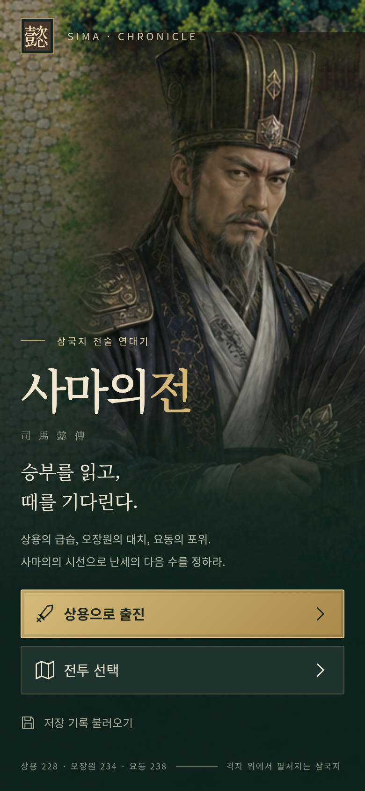
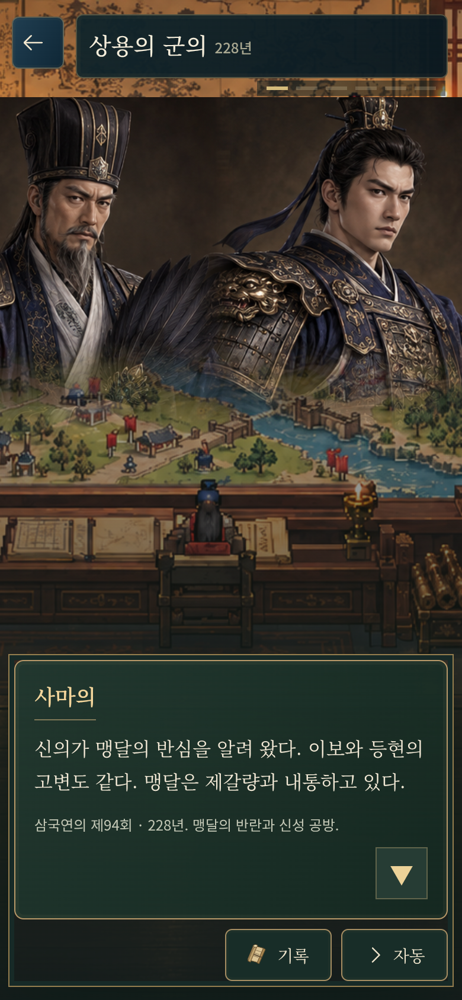
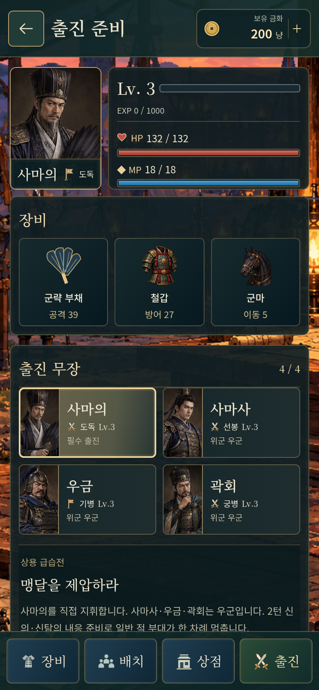
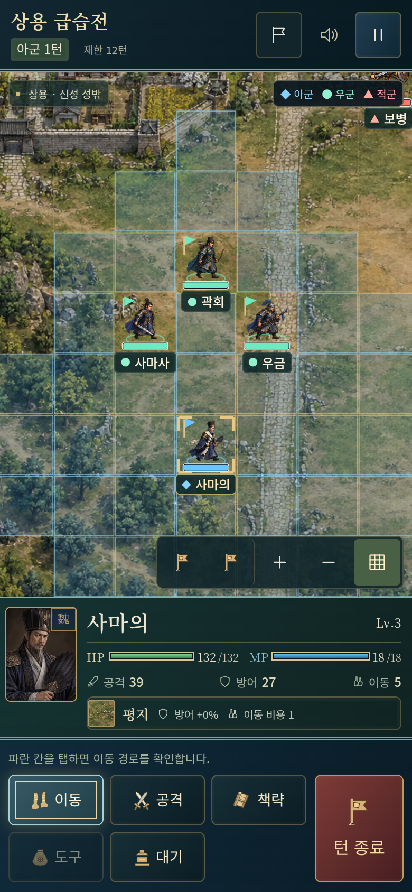
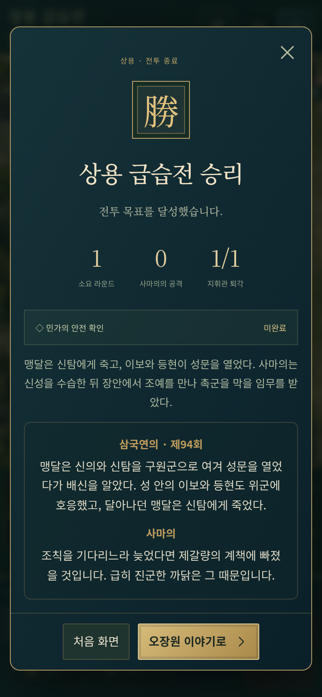
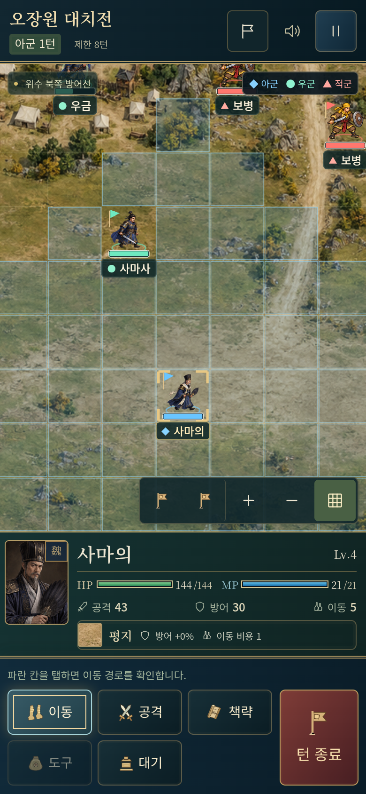
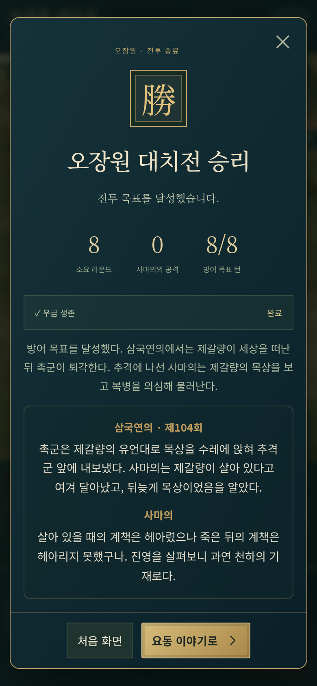
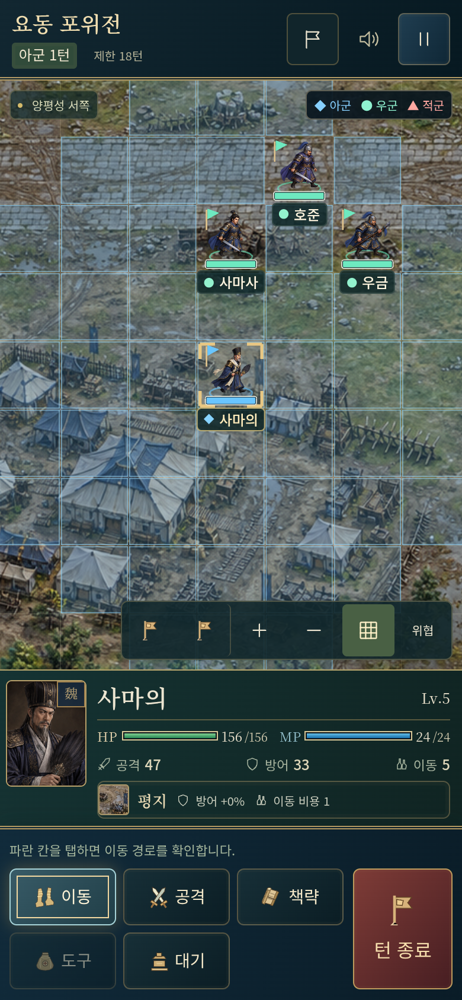
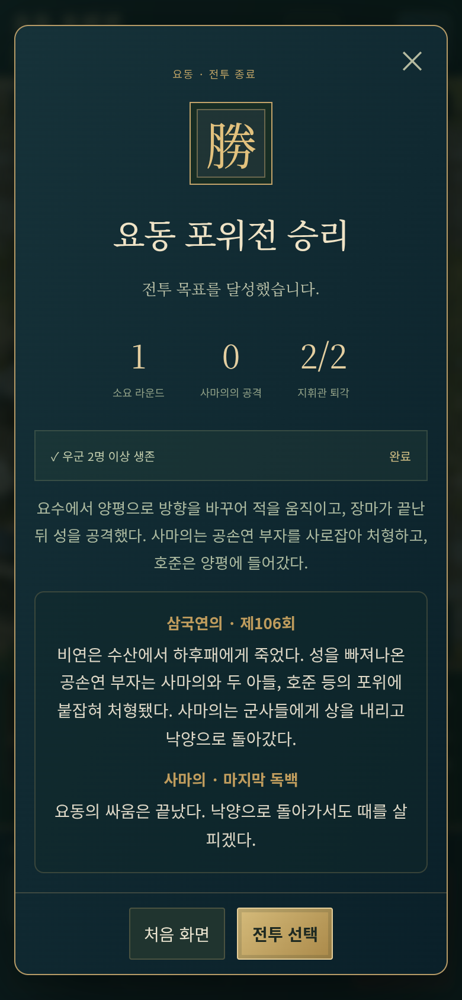

# 사마의전 · 삼국연의 원전과 세로 화면 보정

[공개 게임 실행](https://gnsyoo.github.io/threekingdom-jojo/) · [대조한 삼국연의 원문](../design/REFERENCES.md)

현재 세 원정의 군의와 후일담은 삼국연의 제94회·103~104회·106회를 기준으로 한다. 사건과 인물의 판단을 한국어로 요약해 대화로 옮겼다. 오장원의 목상 퇴각과 요동의 엄격한 군령·공손연 부자의 결말도 원작대로 남긴다. 새로 덧붙이는 창작 독백은 마지막 요동 후일담의 사마의 독백 두 문장뿐이다.

사마사·사마소의 동행은 해당 원문에 등장한다. 전장 구간·우군 명단·턴 수·회복품·지원 시점은 전술 게임의 규칙으로 축약한다. 우금은 牛金이다. 오장원의 8턴 생존은 게임 목표이며 이후 목상에 속아 달아나는 사건을 후일담에서 보여 준다.

[전략 선택](images/sima-choice.png) · [장비 확인](images/sima-equipment.png) · [가로 출진 준비](images/sima-desktop-preparation.png) · [세 원정 선택](images/sima-scenario-selection.png)

## 제1장 · 228년 상용 급습전

- 지도: 18×12, 목표: **맹달을 제압하라**.
- 사건: 2턴 내응 준비.
- 보조 목표: 민가의 안전 확인. 사마의가 왼쪽 민가로 이동한 뒤 행동을 마치세요.
- 전략: 포위망과 보급을 정비한다 / 원군이 오기 전에 급습한다.

[전체 지도](images/sima-shangyong-overview.png) · [데스크톱 전투](images/sima-shangyong-desktop.png)

### 전투 전 이야기

**사마의** — 신의가 맹달의 반심을 알려 왔다. 이보와 등현의 고변도 같다. 맹달은 제갈량과 내통하고 있다.

**사마사** — 아버님, 먼저 천자께 표문을 올려 군사를 움직일 허락을 받으시지요.

**사마의** — 허락을 기다리며 오가면 한 달이 걸린다. 하루에 이틀 길을 가라. 양기는 먼저 가서 맹달에게 출정을 준비하라는 격문을 전하라.

**맹달** — 사마의는 장안으로 갔다고 한다. 신의와 신탐에게 알려 군사를 일으키고 낙양으로 나아가겠다.

**사마의** — 맹달의 사자가 지닌 제갈량의 답서를 얻었다. 우리의 빠른 진군을 내다보았구나. 더욱 서둘러 성을 에워싸라.

**사마사** — 서황 장군이 맹달의 화살에 맞아 돌아가셨습니다. 신의와 신탐은 우리 군에 호응할 준비가 되어 있습니다.

### 원작 후일담

**삼국연의 · 제94회** — 맹달은 신의와 신탐을 구원군으로 여겨 성문을 열었다가 배신을 알았다. 성 안의 이보와 등현도 위군에 호응했고, 달아나던 맹달은 신탐에게 죽었다.

**사마의** — 조칙을 기다리느라 늦었다면 제갈량의 계책에 빠졌을 것입니다. 급히 진군한 까닭은 그 때문입니다.

**사건 요약** — 맹달은 신탐에게 죽고, 이보와 등현이 성문을 열었다. 사마의는 신성을 수습한 뒤 장안에서 조예를 만나 촉군을 막을 임무를 받았다.

## 제2장 · 234년 오장원 대치전

- 지도: 22×14, 목표: **사마의를 지키며 8턴까지 버텨라**.
- 사건: 3턴 곽회 합류.
- 보조 목표: 우금 생존. 부상당한 우금을 생존시키세요. 사마의가 인접하면 회복약으로 지원할 수 있습니다.
- 전략: 진영을 지키며 기다린다 / 전선을 짧게 압박한다.

[전체 지도](images/sima-wuzhang-overview.png) · [데스크톱 전투](images/sima-wuzhang-desktop.png)

### 전투 전 이야기

**사마의** — 상방곡에서 겨우 벗어났고 위수 남쪽 진영마저 잃었다. 이제 북쪽 진영을 지켜라. 다시 함부로 출전하지 마라.

**곽회** — 제갈량이 군사를 이끌고 지세를 살피고 있습니다. 새로 진을 칠 곳을 찾는 듯합니다.

**사마의** — 무공으로 나와 동쪽으로 향하면 위험하다. 오장원에 머문다면 지켜 낼 수 있다. 어디에 주둔하는지 살펴라.

**제갈량** — 출전하지 않으니 여인의 머리쓰개와 옷을 보내겠소. 결전을 할 생각이 있다면 약속한 날에 나오시오.

**사마의** — 도발은 받되 출전하지 않는다. 사자에게 제갈량이 어떻게 먹고 쉬며 일을 맡는지 물어라.

**사마의** — 신비가 지절을 들고 출전하지 말라는 조칙을 전했다. 진영을 지키고 출전을 요구하는 장수들도 따르게 하라.

### 원작 후일담

**삼국연의 · 제104회** — 촉군은 제갈량의 유언대로 목상을 수레에 앉혀 추격군 앞에 내보냈다. 사마의는 제갈량이 살아 있다고 여겨 달아났고, 뒤늦게 목상이었음을 알았다.

**사마의** — 살아 있을 때의 계책은 헤아렸으나 죽은 뒤의 계책은 헤아리지 못했구나. 진영을 살펴보니 과연 천하의 기재로다.

**사건 요약** — 방어 목표를 달성했다. 삼국연의에서는 제갈량이 세상을 떠난 뒤 촉군이 퇴각한다. 추격에 나선 사마의는 제갈량의 목상을 보고 복병을 의심해 물러난다.

## 제3장 · 238년 요동 포위전

- 지도: 24×14, 목표: **공손연과 비연을 제압하라**.
- 사건: 3턴 양평 반격.
- 보조 목표: 우군 2명 이상 생존. 사마사·우금·호준 중 2명 이상을 생존시켜 승리하세요.
- 전략: 비가 그칠 때를 기다린다 / 드러난 틈으로 전진한다.

[전체 지도](images/sima-liaodong-overview.png) · [데스크톱 전투](images/sima-liaodong-desktop.png)

### 전투 전 이야기

**사마의** — 공손연은 스스로 연왕을 칭했다. 성을 버리고 달아나는 것이 상책이요, 양평에 틀어박혀 지키는 것은 하책이다. 사만 군사로 토벌하겠다.

**호준** — 비연과 양조가 요수에 진을 치고, 긴 참호와 목책으로 길을 막았습니다.

**사마의** — 그곳을 버리고 곧장 양평으로 간다. 적이 구원하러 뒤따르면 하후패와 하후위가 길목에서 치게 하라.

**삼국연의 · 제106회** — 양평을 에워싼 뒤 한 달 동안 비가 내렸다. 사마의는 진영을 옮기자는 청을 막고, 군령을 어긴 장수를 처형하면서까지 자리를 지켰다.

**사마의** — 맹달을 칠 때는 우리 군량이 적어 서둘렀다. 지금은 적이 굶주리고 우리는 군량이 있다. 성을 억지로 공격할 까닭이 없다.

**사마의** — 비가 그치면 토산을 쌓고 땅굴을 파며 운제를 세워 성을 공격하라. 공손연이 빠져나갈 길에도 군사를 두어라.

### 원작 후일담

**삼국연의 · 제106회** — 비연은 수산에서 하후패에게 죽었다. 성을 빠져나온 공손연 부자는 사마의와 두 아들, 호준 등의 포위에 붙잡혀 처형됐다. 사마의는 군사들에게 상을 내리고 낙양으로 돌아갔다.

**사마의 · 마지막 독백** — 요동의 싸움은 끝났다. 낙양으로 돌아가서도 때를 살피겠다.

**사건 요약** — 요수에서 양평으로 방향을 바꾸어 적을 움직이고, 장마가 끝난 뒤 성을 공격했다. 사마의는 공손연 부자를 사로잡아 처형하고, 호준은 양평에 들어갔다.

## 세로 화면을 왼쪽으로 밀면 움직이던 문제

모바일 시작 화면과 군의는 세로 스크롤을 허용하지만 인물 초상이 오른쪽 화면 밖까지 배치되어 있었다. 가로 overflow가 자동으로 바뀌어 내부 화면에 수평 스크롤이 생겼다. 390px 화면에서 실제 왼쪽 터치로 시작 화면은 78px, 군의는 55px 이동했다.

시작·군의·준비·모달 본문·장수 정보의 가로 넘침을 숨기고, 터치는 세로 스크롤과 확대를 허용한다. 전장 캔버스는 기존의 지도 드래그·확대를 유지한다. 320·390·768px 세로 화면에서 좌우 실제 터치, 준비 화면 세로 스크롤과 전장 드래그를 함께 검증한다. 기존 사마의전 저장 버전과 명단·좌표는 유지한다.

## 선택 캐릭터가 칸을 벗어나던 문제

기존 64픽셀 높이만 맞추는 방식은 64픽셀 칸의 바닥 위에 발을 두면 머리가 위 칸으로 나가고, 넓은 무기가 좌우로 넘칠 수 있었다. 정지·걷기·공격 프레임 전체의 최대 너비·높이를 함께 계산해 44×44 전장 픽셀 안으로 균일하게 축소한다. 그림의 비율은 유지한다.

발 기준은 칸 바닥에서 14픽셀 위이며 머리 위 깃발과 발 아래 체력바도 칸 안에 배치한다. 공격 전진은 4픽셀·3픽셀로 줄이고 캐릭터 중심을 맞춘다. 이름은 별도의 12px 브라우저 레이어에 남겨서 캐릭터를 줄여도 읽힌다. 개발용 읽기 전용 좌표로 각 장수의 실제 경계가 자신의 칸 안에 드는지 검사한다.

## 리소스와 저장

새 초상 8명과 같은 인물의 걷기·공격 아틀라스, 상용·오장원·양평성 전장 세 장을 새로 생성했다. 투명 부대 PNG를 바꾸지 않고 실제 알파 영역을 읽어 프레임 메타데이터를 작성했다. 초상·장비·준비 지도의 부대도 원본 비율을 유지한다. 자체 폰트는 새 시나리오의 한국어·한자를 포함하도록 다시 만들었다.

사마의전 저장 버전은 2다. 조조편 저장 키를 읽거나 삭제하지 않고 새 키에서 이어간다. 첫 원정의 내응, 곽회 합류, 양평 반격은 저장·복귀 뒤 다시 실행하거나 체력을 재설정하지 않는다. 오장원 승리 기록은 적 지휘관이 살아 있어도 정상 복귀한다.

## 이전 사마의전 전환 검수

전술 규칙 32개와 타입 검사·Pages 경로 빌드가 통과했다. 세 원정을 합법적인 이동·공격·회복·턴 종료로 완주하며, 오장원이 제갈량 생존 중 8턴에 승리하는 경우·사마의 퇴각 우선 판정·다른 캠페인 저장의 보존과 거부도 검사한다.

브라우저 검사 26개는 전체 실행에서 통과한 25개와 요동 편성에 맞게 검사 선택자를 고친 뒤 재실행한 1개 모두 통과했다. 작은 화면 이름표·가로 선택창·폰트 보정 뒤 UI·그래픽 7개도 재실행해 통과했다. 공격 검사를 추가 실행하여 세 개 이상의 실제 공격 자세와 전진 중 사마의의 경계가 칸 안에 있는지 확인했다. 실제 UI에서 세 전투의 승리·후속 원정·저장 복귀, 여섯 장면 자동 대화, 준비 구매·배치·장비, 터치 이동·드래그·회전을 확인했다.

5개 화면 크기에서 8개 상태씩 40개 UI 상태를 자동 검사했고, 선택·준비·장비·전투 화면 20건을 직접 열어 검수했다. 320px 이름표와 짧은 가로 화면의 겹침을 보정한 뒤 다시 확인했다. 검수표와 화면은 [UI-REVIEW](UI-REVIEW.md)에 있다.

## 이번 원전·세로 밀림 수정 검수

전술 규칙 32개, 타입 검사와 Pages 경로 빌드가 통과했다. 변경에 관련된 브라우저 검사 15개가 통과했다. 대화·저장·UI·시나리오 12개는 묶음 실행에서 통과했고, 실제 좌우 터치 3개는 브라우저의 스와이프 직후 탭 억제 시간을 고려해 재실행하여 모두 통과했다.

320×568·390×844·768×1024에서 시작·군의·선택·준비·장비·장수 정보의 가로 스크롤이 0인지 확인했다. 준비 화면의 실제 세로 스크롤과 전장 카메라 드래그도 함께 확인했다. UI 검사에는 다섯 화면 크기에서 여덟 상태씩 40개 상태와 오장원·요동의 회전·동일 부대 크기가 포함된다.

세 원정의 여섯 장면 대화와 원작 후일담을 UI에서 확인했다. 후일담 전용 검사는 검증 가능한 완료 저장을 만들어 결과 화면의 글을 검사하며, 이 검사를 전투 완주 기록으로 계산하지 않는다. 새 창작 독백은 마지막 요동 화면의 두 문장에만 있다. 폰트 8개가 현재 한글·한자 418자를 모두 포함하는지도 확인했다.
