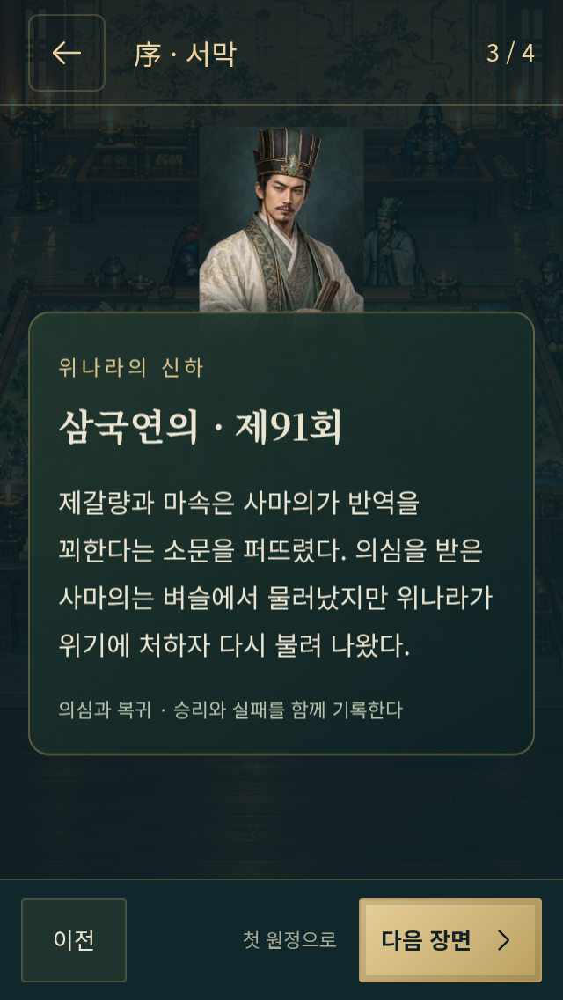
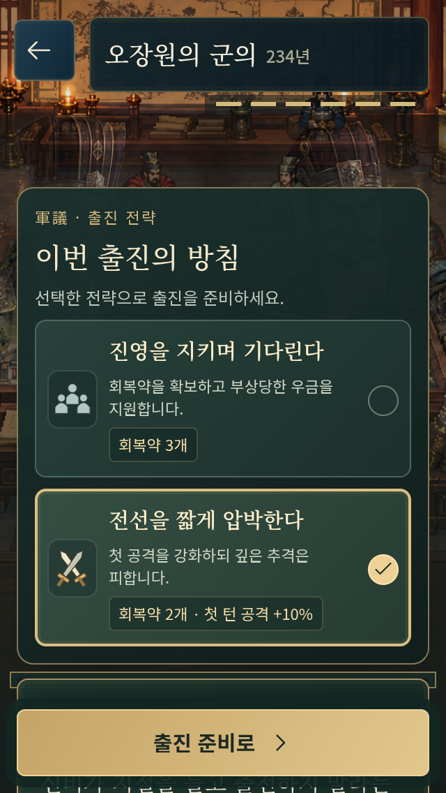
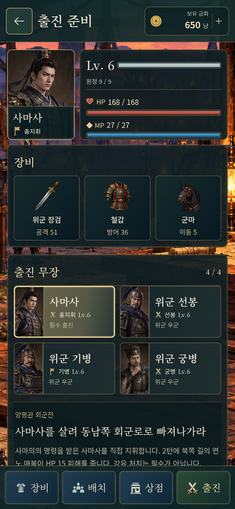
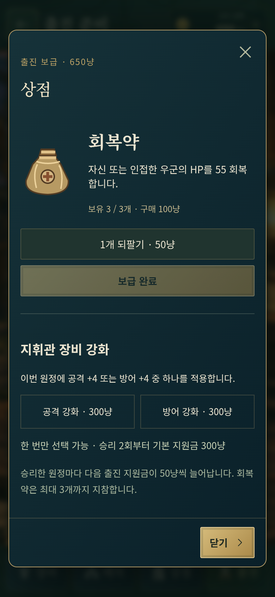
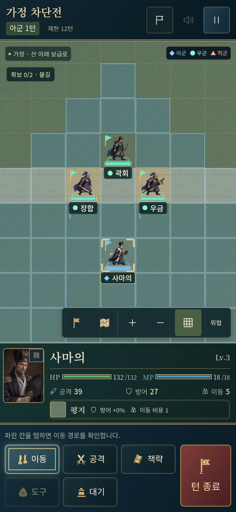
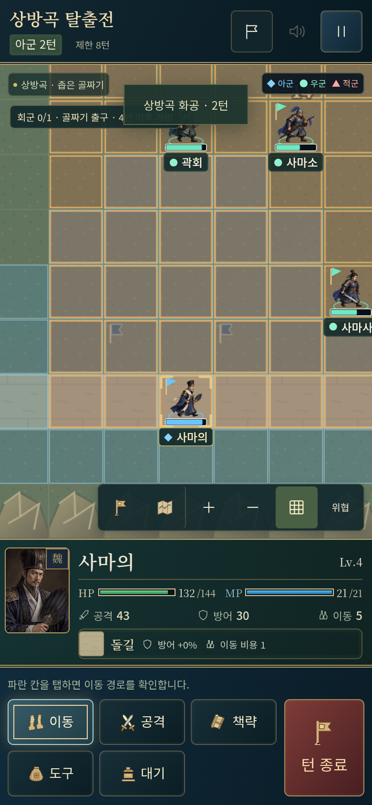
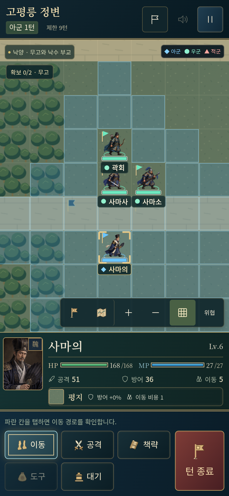
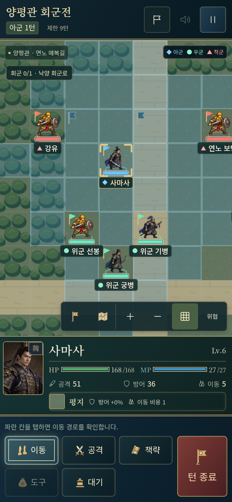
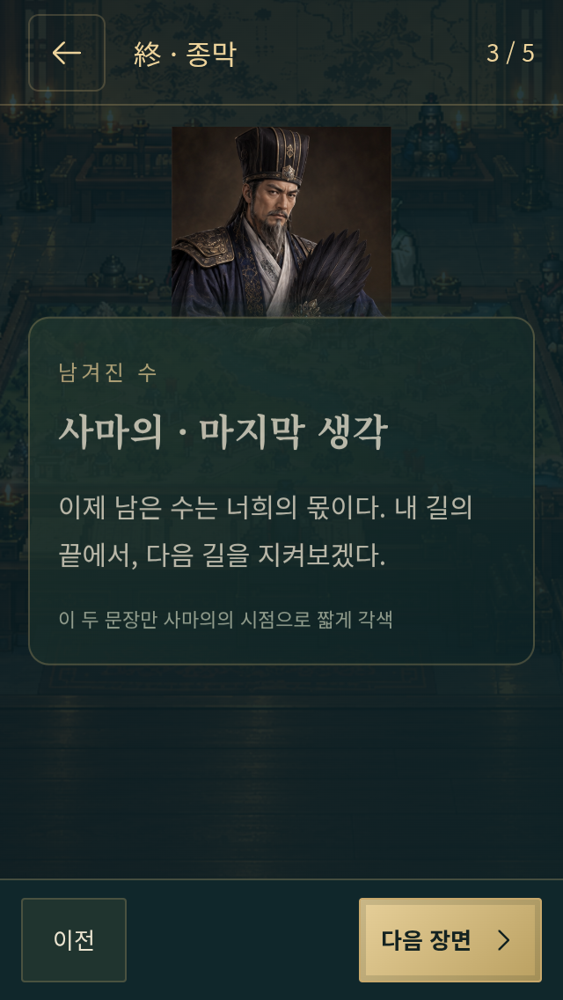
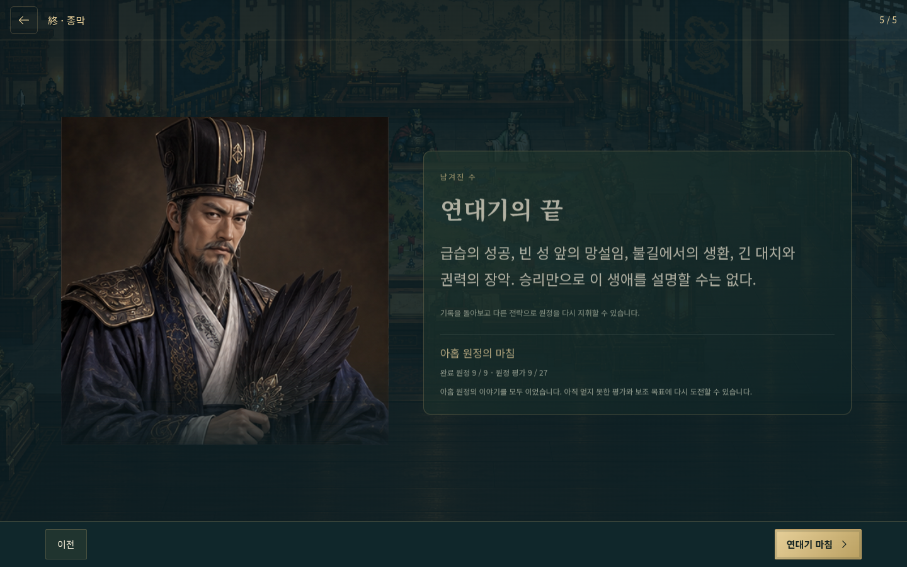

# 사마의전 · 전체 캠페인과 구현 기록

[게임 실행](https://gnsyoo.github.io/threekingdom-jojo/) · [50차 QA](CHRONICLE-QA.md)

220년 서막 네 장면, 아홉 원정의 군의 54장면·후일담 18장면, 251년 종막 다섯 장면을 연결했다. 아래 대사는 실제 `src/scenarios.ts`, `extra-scenarios.ts`, `chronicle.ts`에서 추출한 구현 내용이다.

| 장 | 원정 | 실제 목표 | 사건 | 보조 목표 |
|---|---|---|---|---|
| 1 | 228년 상용 급습전 | 맹달을 제압하라 | 내응 준비 · 2턴 | 민가의 안전 확인 |
| 2 | 228년 가정 차단전 | 물길과 가정 대로를 확보하라 | 산 위의 갈증 · 3턴 | 지휘관 체력 절반 이상 |
| 3 | 228년 서성 회군전 | 성문을 피해 북서쪽 회군로로 빠져나가라 | 성루의 거문고 · 2턴 | 교전 없이 회군 |
| 4 | 231년 기산 방어전 | 사마의를 지키며 6턴까지 버텨라 | 추격 경계 · 3턴 | 지휘관 체력 절반 이상 |
| 5 | 234년 상방곡 탈출전 | 4턴의 비를 기다린 뒤 북서쪽 출구로 탈출하라 | 화공과 소나기 · 2턴 | 지휘관 체력 절반 이상 |
| 6 | 234년 오장원 대치전 | 사마의를 지키며 8턴까지 버텨라 | 곽회 합류 · 3턴 | 우금 생존 |
| 7 | 238년 요동 포위전 | 공손연과 비연을 제압하라 | 양평 반격 · 3턴 | 우군 2명 이상 생존 |
| 8 | 249년 고평릉 정변 | 무고를 먼저 확보하고 낙수 부교에 도달하라 | 조상부의 화살 · 2턴 | 불필요한 교전 없이 접관 |
| 9 | 249년 양평관 회군전 | 사마사를 살려 동남쪽 회군로로 빠져나가라 | 연노 매복 · 2턴 | 지휘관 체력 절반 이상 |

## 원작과 게임의 경계

삼국연의 제78·91·94·95·101·103·104·106·107·108회를 기준으로 한다. 장합의 죽음은 연의의 추격 고집과 사마의의 경고·탄식으로 구성했다. 서성·상방곡·오장원·양평관의 성공 조건은 군사적 완승이 아니라 생존·방어·회군이다. 후일담에서는 원전의 실패를 유지한다. 고평릉의 조상 일족 처형도 누락하지 않는다.

왕릉·수춘은 검토한 이 연의 판본의 직접 사건으로 확인하지 못해 넣지 않았다. 사마의의 사후 진나라 통일을 그의 전투로 만들지 않고 251년 죽음에서 마친다. 양평관은 아버지가 보낸 사마사를 직접 조작한다.

지도·진영·명단·시작 능력치·턴·합류·회복약·거점·화공 피해 수치는 전술 게임용 축약이다. 초상은 원전 인물의 시각화이며 전장 애니메이션은 병과에 맞는 기존 프레임을 일부 공유한다. 종막의 마지막 생각 두 문장만 창작이다. 평가별 세 종막 요약은 플레이 기록의 회고이고 사건을 바꾸는 분기는 아니다.

## 서막

1. **삼국연의 · 제78회** — 220년, 조조는 병상에서 사마의를 비롯한 신하들에게 조비를 보필하라고 부탁했다. 사마의의 길은 조씨 정권의 안에서 이어졌다.

   序 · 위나라의 신하 / 원전 사건을 한국어로 요약

2. **삼국연의 · 제91회** — 226년, 조비도 마지막 부탁을 남겼다. 사마의는 조예를 보필하고 옹주와 양주의 군사를 맡았다.

   226년 · 또 한 번의 고명

3. **삼국연의 · 제91회** — 제갈량과 마속은 사마의가 반역을 꾀한다는 소문을 퍼뜨렸다. 의심을 받은 사마의는 벼슬에서 물러났지만 위나라가 위기에 처하자 다시 불려 나왔다.

   의심과 복귀 · 승리와 실패를 함께 기록한다

4. **삼국연의 · 제94회** — 228년, 맹달의 반란 소식이 도착했다. 사마의는 허락을 기다리는 시간을 버리고 빠른 행군을 택했다. 이제 첫 원정이 시작된다.

   9개 전투·전술 임무 · 급습 / 확보 / 방어 / 회군

## 제1장 · 228년 상용 급습전

사마의를 직접 지휘합니다. 사마사·우금·곽회는 우군입니다. 2턴 신의·신탐의 내응 준비로 일반 적 부대가 한 차례 멈춥니다.

직접 지휘: 사마의 · 지도 18×12 · 제한 12턴 · 빠른 완료 기준 9턴

### 군의

1. **사마의** — 신의가 맹달의 반심을 알려 왔다. 이보와 등현의 고변도 같다. 맹달은 제갈량과 내통하고 있다.

   삼국연의 제94회 · 228년. 맹달의 반란과 신성 공방.

2. **사마사** — 아버님, 먼저 천자께 표문을 올려 군사를 움직일 허락을 받으시지요.

3. **사마의** — 허락을 기다리며 오가면 한 달이 걸린다. 하루에 이틀 길을 가라. 양기는 먼저 가서 맹달에게 출정을 준비하라는 격문을 전하라.

4. **맹달** — 사마의는 장안으로 갔다고 한다. 신의와 신탐에게 알려 군사를 일으키고 낙양으로 나아가겠다.

5. **사마의** — 맹달의 사자가 지닌 제갈량의 답서를 얻었다. 우리의 빠른 진군을 내다보았구나. 더욱 서둘러 성을 에워싸라.

   사마의를 직접 조작하고 세 우군은 자동으로 지원합니다.

6. **사마사** — 서황 장군이 맹달의 화살에 맞아 돌아가셨습니다. 신의와 신탐은 우리 군에 호응할 준비가 되어 있습니다.

   포위전 보급: 회복약 3개. 급습 강화: 회복약 2개와 첫 턴 공격 +10%.

### 후일담

1. **삼국연의 · 제94회** — 맹달은 신의와 신탐을 구원군으로 여겨 성문을 열었다가 배신을 알았다. 성 안의 이보와 등현도 위군에 호응했고, 달아나던 맹달은 신탐에게 죽었다.

2. **사마의** — 조칙을 기다리느라 늦었다면 제갈량의 계책에 빠졌을 것입니다. 급히 진군한 까닭은 그 때문입니다.

## 제2장 · 228년 가정 차단전

두 금빛 거점에서 행동을 마치세요. 마속 처치는 필수가 아닙니다. 3턴에는 산 위 촉군의 혼란이 발생합니다.

직접 지휘: 사마의 · 지도 18×12 · 제한 12턴 · 빠른 완료 기준 8턴

### 군의

1. **사마의** — 가정과 열류성은 한중으로 이어지는 길목이다. 가정의 길을 끊으면 제갈량은 군량을 잇기 어렵다.

   삼국연의 제95회 · 228년. 한중의 목줄을 잡다.

2. **장합** — 그렇다면 가정으로 먼저 군사를 보내야겠습니다.

3. **사마의** — 먼저 멀리 정찰하라. 제갈량은 맹달과 다르다. 매복을 살피지 않고 가볍게 전진하지 마라.

4. **왕평** — 당도에 진을 쳐야 합니다. 산 위에만 머물면 물길이 끊겼을 때 버틸 수 없습니다.

5. **마속** — 산 위에서 죽을 곳에 들어가야 살 길을 얻을 수 있다. 내 군사를 산에 올리겠다.

6. **사마의** — 산 아래 물과 길을 끊어라. 적의 진영에만 매달릴 까닭이 없다.

   금빛 물길·대로에서 대기나 행동을 마치면 확보됩니다.

### 후일담

1. **삼국연의 · 제95회** — 마속은 왕평의 간언을 듣지 않고 산 위에 진을 쳤다. 위군이 물을 끊자 촉군은 혼란에 빠졌고, 왕평이 퇴각하는 군사를 수습했다.

2. **삼국연의 · 제95회** — 가정의 패전 소식이 제갈량에게 닿았다. 사마의의 군사는 서성으로 향했다.

## 제3장 · 228년 서성 회군전

회군로는 금빛 칸입니다. 성문에 남은 수비대는 자리를 지킵니다. 공격 대신 진로와 우군 방침을 선택하세요.

직접 지휘: 사마의 · 지도 18×12 · 제한 7턴 · 빠른 완료 기준 4턴

### 군의

1. **삼국연의 · 제95회** — 가정을 잃은 제갈량은 서성에 적은 군사만 남겨 두었다. 성문을 열고 백성에게 길을 쓸게 했다.

   삼국연의 제95회 · 공성계. 퇴각도 하나의 선택이다.

2. **사마의** — 성문이 열려 있고, 제갈량이 성루에서 거문고를 타고 있다.

3. **사마소** — 군사가 없어 보입니다. 어찌하여 물러나려 하십니까?

4. **사마의** — 제갈량은 평생 조심스럽게 군사를 썼다. 문을 크게 열었다면 안에 매복이 있을 것이다.

5. **삼국연의 · 제95회** — 제갈량은 성루에 앉아 위군이 물러가는 것을 지켜보았다.

6. **사마의** — 다른 길로 물러나라. 성 안으로 들어가지 않는다.

   이번 목표는 적 처치가 아니라 회군로 도달입니다.

### 후일담

1. **삼국연의 · 제95회** — 제갈량의 공성계는 성공했다. 사마의는 빈 성을 함정으로 여겨 물러났고, 촉군은 퇴각할 시간을 얻었다.

2. **삼국연의 · 제95회** — 이후 사마의는 성이 비었다는 소식을 들었다. 가정에서의 승리가 제갈량의 모든 계책을 꿰뚫었다는 뜻은 아니었다.

## 제4장 · 231년 기산 방어전

숲과 진영에서 방어하고 우군을 지휘하세요. 6턴 시작까지 생존하면 방어 목표를 달성합니다. 적 지휘관 처치는 필수가 아닙니다.

직접 지휘: 사마의 · 지도 20×12 · 제한 6턴 · 빠른 완료 기준 6턴

### 군의

1. **삼국연의 · 제101회** — 제갈량의 북벌은 계속됐다. 사마의는 함부로 싸우기보다 진영을 굳히려 했다.

   삼국연의 제101회 · 방어와 추격의 경계.

2. **장합** — 촉군이 물러나면 제가 앞장서 추격하겠습니다.

3. **사마의** — 촉군이 물러가는 험한 길에는 매복이 있을 것이다. 추격하더라도 매우 조심해야 한다.

4. **삼국연의 · 제101회** — 이엄은 군량을 잇지 못한 책임을 감추려고 동오의 침입을 알리는 서신을 보냈다. 제갈량은 회군을 준비했다.

5. **사마의** — 지금은 전열을 지킨다. 적이 물러난다고 해서 모든 위험이 사라진 것은 아니다.

6. **삼국연의 · 제101회** — 장합은 공을 세우려 추격을 고집했다. 목문도로 이어지는 길에 함정이 기다리고 있었다.

   방어 목표 이후의 추격과 장합의 죽음은 원작 후일담에서 이어집니다.

### 후일담

1. **삼국연의 · 제101회** — 위연과 관흥은 번갈아 거짓 패주하며 장합을 목문도로 유인했다. 길이 막힌 뒤 쇠뇌가 일제히 발사됐고 장합은 죽었다.

2. **사마의** — 장준의가 죽었으니, 나의 허물이다.

## 제5장 · 234년 상방곡 탈출전

2·3턴에 불길 안의 부대가 HP 12 피해를 받습니다. 4턴의 비가 불을 끄면 출구에서 행동을 마쳐 탈출하세요. 격파보다 생존이 우선입니다.

직접 지휘: 사마의 · 지도 18×12 · 제한 8턴 · 빠른 완료 기준 6턴

### 군의

1. **삼국연의 · 제103회** — 제갈량은 상방곡에 불붙일 것을 숨기고 사마의를 골짜기 안으로 유인했다.

   삼국연의 제103회 · 화공에서 벗어나다.

2. **사마의** — 촉군이 버리고 간 군량과 길을 따라왔는데, 골짜기에서 불길이 일어났다.

3. **사마사** — 앞뒤의 길이 막혔습니다. 군사들이 불 속에 갇혔습니다.

4. **삼국연의 · 제103회** — 사마의는 두 아들과 함께 죽을 위기에 놓였다. 그때 큰비가 내려 불을 껐다.

5. **삼국연의 · 제103회** — 제갈량은 하늘을 우러러 탄식했다. 사마의 부자는 그 틈을 타 골짜기를 빠져나갔다.

6. **삼국연의 · 제103회** — 부자는 달아났으나 위수 남쪽 진영까지 촉군에게 빼앗겼다. 북쪽을 지키는 긴 대치가 이어졌다.

   불길은 표시된 칸에만 피해를 줍니다. 4턴 이후 출구가 열립니다.

### 후일담

1. **삼국연의 · 제103회** — 갑작스러운 비가 부자의 목숨을 살렸다. 위수 남쪽 진영을 잃은 사마의는 북쪽 진영으로 물러나 굳게 지켰다.

2. **삼국연의 · 제103회** — 제갈량은 오장원에 진을 치고 위군을 다시 끌어내려 했다. 이후의 승부는 공격보다 인내를 요구했다.

## 제6장 · 234년 오장원 대치전

공격보다 생존이 우선입니다. 우금은 부상 상태로 진영을 지킵니다. 3턴에 곽회가 합류하며 8턴 시작까지 버티면 승리합니다.

직접 지휘: 사마의 · 지도 22×14 · 제한 8턴 · 빠른 완료 기준 8턴

### 군의

1. **사마의** — 상방곡에서 겨우 벗어났고 위수 남쪽 진영마저 잃었다. 이제 북쪽 진영을 지켜라. 다시 함부로 출전하지 마라.

   삼국연의 제103~104회 · 234년. 상방곡 이후의 대치와 목상 계책.

2. **곽회** — 제갈량이 군사를 이끌고 지세를 살피고 있습니다. 새로 진을 칠 곳을 찾는 듯합니다.

3. **사마의** — 무공으로 나와 동쪽으로 향하면 위험하다. 오장원에 머문다면 지켜 낼 수 있다. 어디에 주둔하는지 살펴라.

4. **제갈량** — 출전하지 않으니 여인의 머리쓰개와 옷을 보내겠소. 결전을 할 생각이 있다면 약속한 날에 나오시오.

5. **사마의** — 도발은 받되 출전하지 않는다. 사자에게 제갈량이 어떻게 먹고 쉬며 일을 맡는지 물어라.

   우금은 부상 상태로 시작합니다. 3턴에 곽회가 합류합니다.

6. **사마의** — 신비가 지절을 들고 출전하지 말라는 조칙을 전했다. 진영을 지키고 출전을 요구하는 장수들도 따르게 하라.

   사마의가 생존한 채 8턴이 시작되면 방어 목표를 달성합니다.

### 후일담

1. **삼국연의 · 제104회** — 촉군은 제갈량의 유언대로 목상을 수레에 앉혀 추격군 앞에 내보냈다. 사마의는 제갈량이 살아 있다고 여겨 달아났고, 뒤늦게 목상이었음을 알았다.

2. **사마의** — 살아 있을 때의 계책은 헤아렸으나 죽은 뒤의 계책은 헤아리지 못했구나. 진영을 살펴보니 과연 천하의 기재로다.

## 제7장 · 238년 요동 포위전

공손연군은 3턴부터 반격합니다. 일반 병력을 정리하고 공손연·비연을 함께 제압하세요. 위협 표시로 위험한 칸을 확인할 수 있습니다.

직접 지휘: 사마의 · 지도 24×14 · 제한 18턴 · 빠른 완료 기준 15턴

### 군의

1. **사마의** — 공손연은 스스로 연왕을 칭했다. 성을 버리고 달아나는 것이 상책이요, 양평에 틀어박혀 지키는 것은 하책이다. 사만 군사로 토벌하겠다.

   삼국연의 제106회 · 238년. 요수의 계책과 양평 포위.

2. **호준** — 비연과 양조가 요수에 진을 치고, 긴 참호와 목책으로 길을 막았습니다.

3. **사마의** — 그곳을 버리고 곧장 양평으로 간다. 적이 구원하러 뒤따르면 하후패와 하후위가 길목에서 치게 하라.

4. **삼국연의 · 제106회** — 양평을 에워싼 뒤 한 달 동안 비가 내렸다. 사마의는 진영을 옮기자는 청을 막고, 군령을 어긴 장수를 처형하면서까지 자리를 지켰다.

5. **사마의** — 맹달을 칠 때는 우리 군량이 적어 서둘렀다. 지금은 적이 굶주리고 우리는 군량이 있다. 성을 억지로 공격할 까닭이 없다.

   요수·수산·양평의 공방을 한 전장에서 진행합니다.

6. **사마의** — 비가 그치면 토산을 쌓고 땅굴을 파며 운제를 세워 성을 공격하라. 공손연이 빠져나갈 길에도 군사를 두어라.

   포위전 보급: 회복약 3개. 돌파 강화: 회복약 2개와 첫 턴 공격 +10%.

### 후일담

1. **삼국연의 · 제106회** — 비연은 수산에서 하후패에게 죽었다. 성을 빠져나온 공손연 부자는 사마의와 두 아들, 호준 등의 포위에 붙잡혀 처형됐다. 사마의는 군사들에게 상을 내리고 낙양으로 돌아갔다.

2. **삼국연의 · 제106회** — 낙양에서는 병든 조예가 사마의의 귀환을 기다리고 있었다. 사마의는 조상을 비롯한 신하들과 함께 어린 조방을 보필하라는 부탁을 받았다.

## 제8장 · 249년 고평릉 정변

무고와 부교에서 순서대로 행동을 마칩니다. 조상부의 궁병은 자리를 지킵니다. 우회와 방어 대기를 활용하세요. 조상을 쓰러뜨리는 전투가 아닙니다.

직접 지휘: 사마의 · 지도 20×12 · 제한 9턴 · 빠른 완료 기준 6턴

### 군의

1. **삼국연의 · 제106~107회** — 조예가 죽은 뒤 조상과 사마의가 조방을 보필했다. 조상은 권력을 독점했고 사마의는 병든 모습을 보이며 물러나 있었다.

   삼국연의 제106~107회 · 낙양의 권력 이동.

2. **삼국연의 · 제106회** — 이승은 사마의의 병을 살피러 왔다. 사마의는 말을 잘 듣지 못하고 죽을 삼키지 못하는 듯 꾸며 조상을 안심시켰다.

3. **삼국연의 · 제107회** — 조방과 조상 형제가 고평릉에 나가자 사마의는 움직였다. 고유와 왕관을 보내 조상 형제의 군영을 접관하게 했다.

4. **삼국연의 · 제107회** — 사마의는 태후에게 아뢰고 무고를 장악했다. 조상부의 반거가 궁병에게 활을 쏘게 하여 길을 막았다.

5. **삼국연의 · 제107회** — 손겸이 활쏘기를 말렸고, 사마소가 아버지를 호위해 지나갔다. 사마의는 성을 나가 낙수 부교에 주둔했다.

6. **삼국연의 · 제107회** — 낙양과 부교를 확보한 뒤 사신을 보내 조상에게 병권을 내놓으라고 했다.

   금빛 1번 무고를 확보한 뒤 2번 부교로 이동하세요.

### 후일담

1. **삼국연의 · 제107회** — 환범은 천자를 모시고 허창으로 가서 군사를 모으라고 권했다. 조상은 병권만 거두겠다는 말을 믿고 돌아와 항복했다.

2. **삼국연의 · 제107회** — 사마의는 조상과 그 측근들을 역모로 처형하고 일족을 멸했다. 이 사건 뒤 사마씨는 조정의 권력을 장악했다.

## 제9장 · 249년 양평관 회군전

사마의의 명령을 받은 사마사를 직접 지휘합니다. 2턴에 북쪽 길의 연노 매복이 HP 15 피해를 줍니다. 강유 처치는 필수가 아닙니다.

직접 지휘: 사마사 · 지도 20×12 · 제한 9턴 · 빠른 완료 기준 6턴

### 군의

1. **삼국연의 · 제107~108회** — 강유의 군사가 옹주를 위협했다. 곽회의 보고를 받은 사마의는 조정과 의논한 뒤 장자 사마사를 원군으로 보냈다.

   삼국연의 제107~108회 · 마지막 임무의 직접 지휘 장수는 사마사입니다.

2. **삼국연의 · 제108회** — 사마사는 촉군이 약해졌다고 보고 뒤를 쫓았다. 추격은 양평관까지 이어졌다.

3. **삼국연의 · 제108회** — 강유는 제갈량에게 배운 연노를 양쪽에 숨겨 두었다. 한 번에 열 발을 쏘는 쇠뇌에 위군의 선두가 쓰러졌다.

4. **삼국연의 · 제108회** — 사마사는 어지러운 군사들 사이에서 목숨을 건져 돌아갔다.

5. **삼국연의 · 제108회** — 곡산의 구안은 구원이 닿지 않자 위군에 항복했다. 강유는 한중으로 물러났고 사마사는 낙양으로 돌아갔다.

6. **삼국연의 · 제108회** — 이 싸움 뒤 사마의의 생애는 마지막 장으로 접어든다. 양평관에서 잃은 군사들은 돌아오지 못했다.

   회군로에서 행동을 마치면 임무가 끝나고 251년 엔딩을 볼 수 있습니다.

### 후일담

1. **삼국연의 · 제108회** — 사마사는 추격에 성공한 것이 아니라 연노의 매복에서 살아 돌아왔다. 낙양으로 돌아간 뒤 아버지의 마지막 부탁을 들었다.

2. **삼국연의 · 제108회** — 251년 가을, 사마의의 병이 깊어졌다. 그는 사마사와 사마소를 불러 국정을 신중하게 다스리라고 당부했다.

## 251년 종막

1. **삼국연의 · 제108회** — 양평관에서 돌아온 사마사는 낙양에 머물렀다. 아버지의 마지막은 새 영토를 얻는 전장이 아니라 병상이었다.

   終 · 251년 가을

2. **사마의 · 원전 유언** — 나는 여러 해 위를 섬겼고 태부에 이르렀다. 사람들은 내게 다른 뜻이 있다고 의심했고, 나도 늘 두려워했다. 내가 죽은 뒤 너희는 국정을 잘 다스려라. 신중하라, 또 신중하라.

   삼국연의 제108회의 유언을 한국어로 옮김

3. **사마의 · 마지막 생각** — 이제 남은 수는 너희의 몫이다. 내 길의 끝에서, 다음 길을 지켜보겠다.

   이 두 문장만 사마의의 시점으로 짧게 각색

4. **삼국연의 · 제108회** — 사마의는 말을 마친 뒤 세상을 떠났다. 사마사와 사마소는 조방에게 알렸고, 조정은 장례와 시호를 내렸다. 두 아들이 권력을 이어 맡았다.

   사마의의 생애는 여기에서 끝난다

5. **연대기의 끝** — 급습의 성공, 빈 성 앞의 망설임, 불길에서의 생환, 긴 대치와 권력의 장악. 승리만으로 이 생애를 설명할 수는 없다.

   기록을 돌아보고 다른 전략으로 원정을 다시 지휘할 수 있습니다.

### 기록에 따른 종막 요약

| 조건 | 요약 |
|---|---|
| 미완료 원정이 남음 | 남겨진 원정 기록 |
| 아홉 원정 완료, 평가 24성 미만 | 아홉 원정의 마침 |
| 아홉 원정 완료, 평가 24성 이상 | 군략을 남긴 완주 |

첫 결과 이후 종막은 제목에서도 다시 볼 수 있다. 세 경우 모두 병상 유언과 251년 죽음은 같은 내용이다.

## 플레이 개선

진격·호위·유지의 우군 방침, 대기의 피해 감소, 우군까지 닿는 격려, 전체 적군 위협 표시, 거점 위치로 카메라 이동을 추가했다. 순서가 필요한 고평릉, 비를 기다려야 하는 상방곡, 교전을 피하는 서성이 공격 반복과 다른 판단을 요구한다.

지원금은 기본 200냥에 서로 다른 완료 원정마다 50냥씩 늘어난다. 공격/방어 강화는 준비 중 300냥, +4, 하나만 선택한다. 회복약 거래와 강화 결과·시작 위치를 준비 저장에 함께 남긴다. 평가와 최단 완료 기록은 재도전에서 좋아진 값만 보존한다.

## 구현 화면

검수 사진의 일부는 화면 조건을 최대치로 만들기 위한 저장 fixture다. 실제 행동만으로 완료한 새 임무 여섯 장의 검증은 브라우저 테스트와 QA 문서에서 별도로 구분한다.
