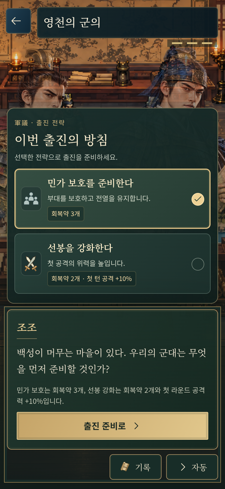
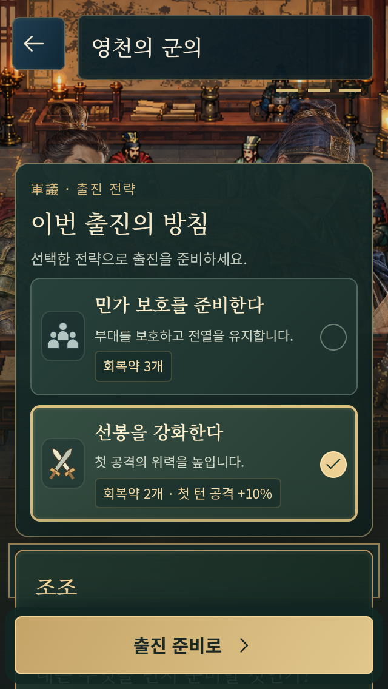
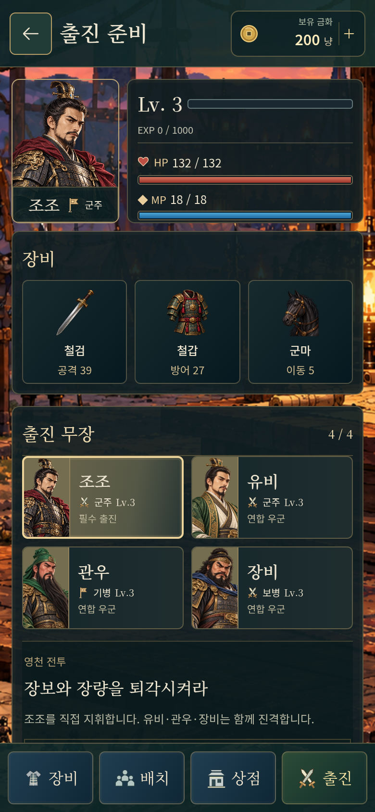
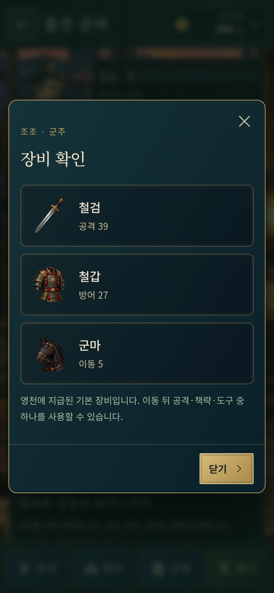
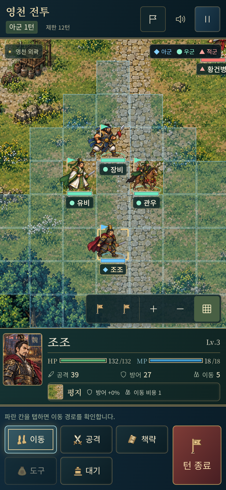
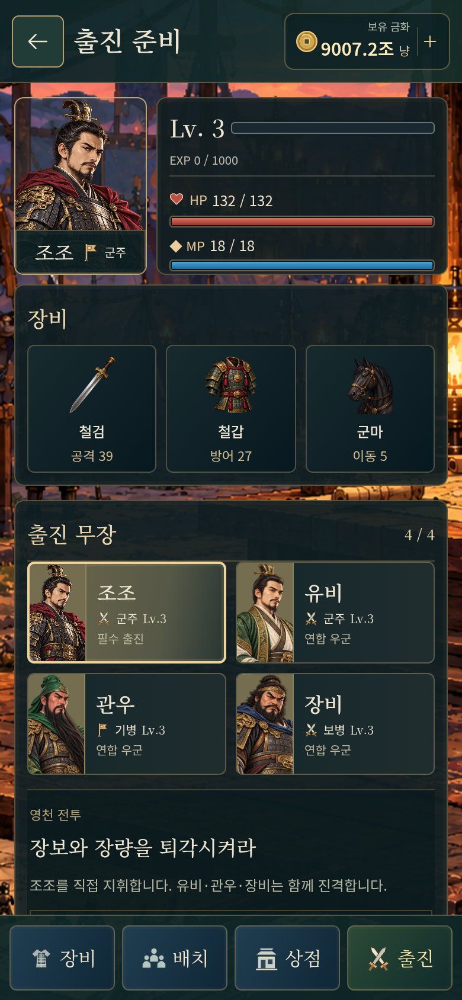

# UI·UX와 그래픽 개선 검수

[게임 실행](https://gnsyoo.github.io/threekingdom-jojo/)

## 적용한 구성

- 군의 선택: 별도 제목, 전략 설명, 보급·공격 효과, 선택 체크와 확인 버튼. 짧은 세로 화면에서는 확인 버튼이 하단에 고정된다. 선택을 바꿔도 스크롤 위치와 키보드 포커스를 유지한다.
- 출진 준비: 일관된 여백·테두리·버튼 크기, 본문 스크롤과 고정 출진 메뉴. 가로 휴대폰은 초상과 능력치를 나란히 두어 얼굴이 과하게 잘리지 않게 한다. 무장 선택 뒤에도 목록의 위치를 유지한다.
- 초상·장비: 아틀라스의 실제 원본 영역을 잘라 같은 비율로 맞춘다. 장비는 중앙에 놓인 고정 크기 아이콘 칸과 별도의 설명 칸을 쓴다. 회복약 위로 이웃 그림이 보이던 경계도 보정했다.
- 금화: 동전·보유 금화·숫자·상점 버튼이 각 영역 안에 들어간다. 100만 이상은 한국어 단위로 줄이고 전체 금액은 접근성 이름과 툴팁에 보존한다. 상점 계산은 전체 금액으로 진행한다.
- 전투: 이름과 지명은 지도와 분리해 12px 브라우저 글자로 표시한다. 확대·축소·회전 때도 글자 크기는 유지하고 이동 중에는 부대를 따라간다. 작은 전체 지도에서는 선택 장수·지휘관의 이름을 우선한다.
- 그래픽: 원본 일러스트를 비율대로 렌더링하고 부드러운 이미지 필터와 최대 2배 캔버스 해상도를 쓴다. 장수·기병·적 지휘관의 최대 높이를 64 전장 픽셀로 통일했다. 정지·걷기·공격에 같은 기준을 쓰며 검은 그림자는 추가하지 않았다.
- 폰트: 기존 파일에 빠졌던 한국어 56자를 보완했다. 현재 UI에 쓰인 한글·한자 341자를 두 서체와 네 굵기에 모두 포함했다. 원본 이미지 재제작 대신 실제 화면에서의 축소·확대·문자 렌더링 품질을 개선했다.

## 직접 화면 검수 20건

각 화면의 스크린샷을 열어 배치·이미지 비율·글자·조작 위치를 확인했다. 자동 검사만으로 드러나지 않은 얼굴 잘림, 확인 버튼 위치, 패널의 빈 공간도 수정했다.

| 번호 | 환경 | 화면 | 확인과 보정 |
|---|---|---|---|
| 1 | 320×568 세로 | 전략 선택 | 선택 확인 버튼을 하단에 고정해 스크롤 없이 진행 가능 |
| 2 | 320×568 세로 | 준비·무장 | 좁은 초상 칸에서도 원본 비율 유지, 목록 선택 뒤 위치 보존 |
| 3 | 320×568 세로 | 장비 창 | 아이콘 정렬과 닫기 버튼 고정, 본문만 내부 스크롤 |
| 4 | 320×568 세로 | 전투 | 이름표 12px·2배 렌더링, 명령 버튼 글자와 터치 영역 확인 |
| 5 | 390×844 세로 | 전략 선택 | 선택·미선택의 테두리·배경·체크 구분 |
| 6 | 390×844 세로 | 준비·무장 | HP/MP 막대 두께, 초상과 장비 카드의 간격 보정 |
| 7 | 390×844 세로 | 장비 창 | 무기·갑옷·군마를 같은 아이콘 칸에 중앙 정렬 |
| 8 | 390×844 세로 | 전투 | 얇은 진영 표시, 선명한 이름표, 지도와 정보창의 구분 |
| 9 | 844×390 가로 | 전략 선택 | 두 전략을 나란히 표시하고 효과 문구·확정 버튼 확인 |
| 10 | 844×390 가로 | 준비·무장 | 과하게 확대되던 초상 대신 초상·능력치를 나란히 배치 |
| 11 | 844×390 가로 | 장비 창 | 닫기를 고정하고 긴 내용만 스크롤 |
| 12 | 844×390 가로 | 전투 | 고해상도 터치 좌표, 오른쪽 정보창·하단 명령 확인 |
| 13 | 768×1024 세로 | 전략 선택 | 인물·선택·대화가 겹치지 않고 읽히는지 확인 |
| 14 | 768×1024 세로 | 준비·무장 | 세로 정보 순서, 고정 메뉴와 원본 초상 비율 확인 |
| 15 | 768×1024 세로 | 장비 창 | 카드별 아이콘 기준선과 문구 위치 확인 |
| 16 | 768×1024 세로 | 전투 | 민가·부대 이름, 최대 2배 캔버스·확대 조작 확인 |
| 17 | 1440×900 | 전략 선택 | 독립된 선택 패널, 선택 표시와 확인 버튼 확인 |
| 18 | 1440×900 | 준비·무장 | 출진 지도 아래의 큰 빈 패널 공간 제거 |
| 19 | 1440×900 | 장비 창 | 장비 아이콘 위치와 회복약 아틀라스 경계 보정 |
| 20 | 1440×900 | 전투 | 동일한 부대 크기와 읽히는 지명·이름표 확인 |

## 반복 자동 검수 40개 상태

`tests/browser/polish.spec.ts`에서 아래 8개 상태를 5개 화면 크기로 반복한다. 각 상태를 실제 클릭·터치로 연 뒤 문구 넘침·가로 넘침을 검사하고 스크린샷을 저장한다. 개선 후 같은 행렬을 다시 확인했다. 폰트를 보완한 뒤에도 같은 검사를 수행한다.

| 상태 | 320×568 | 390×844 | 844×390 | 768×1024 | 1440×900 |
|---|---|---|---|---|---|
| 시작 버튼 | 1 | 9 | 17 | 25 | 33 |
| 첫 대화·초상 | 2 | 10 | 18 | 26 | 34 |
| 전략 미선택 | 3 | 11 | 19 | 27 | 35 |
| 전략 선택·전환·포커스 | 4 | 12 | 20 | 28 | 36 |
| 무장 선택·초상·준비 메뉴 | 5 | 13 | 21 | 29 | 37 |
| 장비 아이콘·닫기 | 6 | 14 | 22 | 30 | 38 |
| 큰 금액·금화 영역 | 7 | 15 | 23 | 31 | 39 |
| 전투 해상도·이름표·크기·확대·터치 | 8 | 16 | 24 | 32 | 40 |

큰 금액은 200, 999,999, 1,000,000, 123,456,789, 10,000,000,000, JavaScript 최대 안전 정수(9,007,199,254,740,991)로 실제 준비 화면 컴포넌트를 렌더링해 검사했다. 현재 전투 지원금은 200냥으로 유지한다.

추가로 사수관·호로관을 세로→가로→세로로 돌려 4개 전투 화면을 확인한다. 손견·화웅·여포의 초상 비율, 모든 부대의 높이, 지명 크기, 지도 폭과 버튼도 검사한다.

## 기능과 빌드

UI 검수 외에도 기존 준비 구매·배치·출진, 대화 자동 재생, 걷기·공격 프레임, 터치 이동·드래그, 세 전투의 이벤트와 저장 복귀, 화면 회전을 확인했다. 관련 브라우저 검사 16개, 폰트 보완 뒤 UI·그래픽 재검사 7개, 전투 규칙 30개와 타입 검사·Pages 경로 빌드가 통과했다.

검수 환경은 시스템 Chromium과 휴대폰·태블릿·데스크톱 뷰포트, 화면 밀도 1·2다. 실제 기기 성능 측정이나 Android/iOS 패키징 검증은 별도 범위다. 원본 이미지의 세부 묘사는 보존하며, 독립된 4방향 동작이나 새 일러스트 세트는 이번 변경에 포함하지 않았다.
